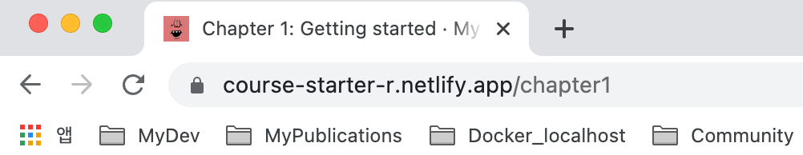
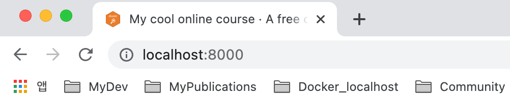
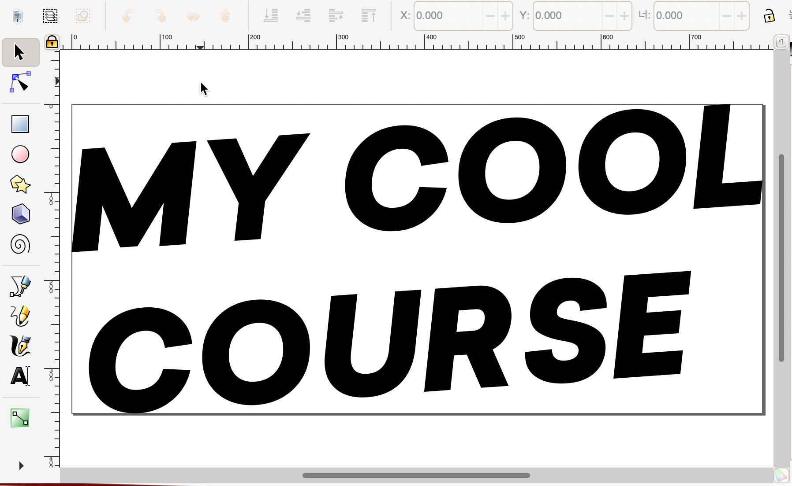
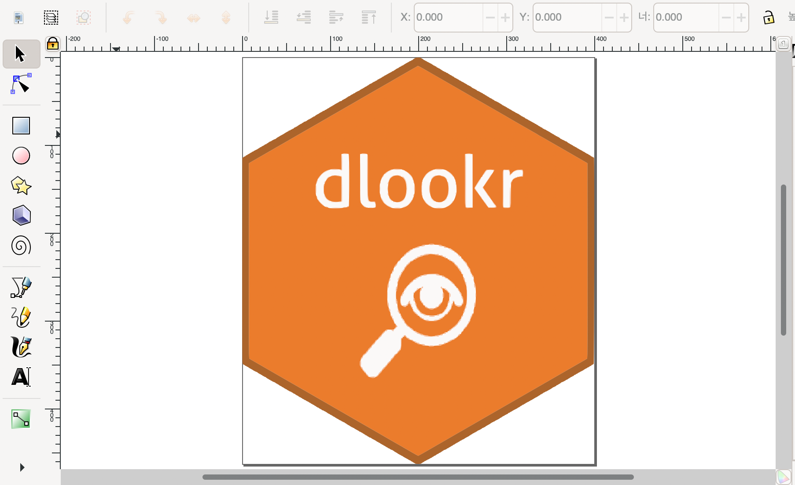
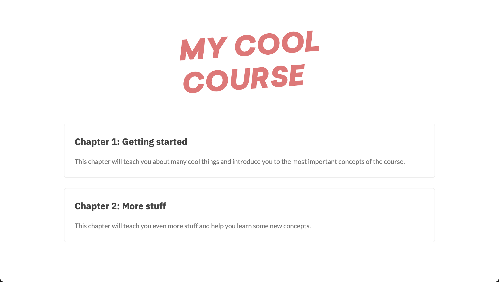
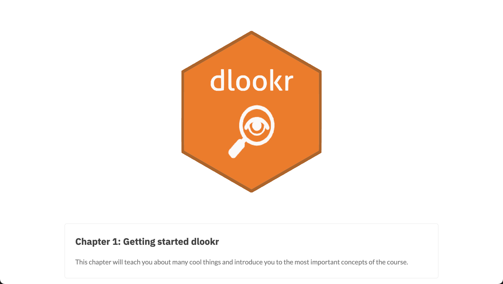
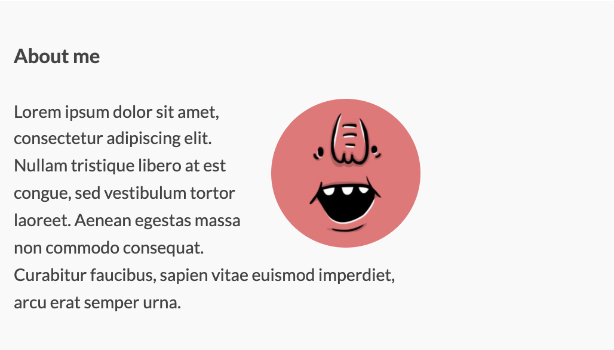
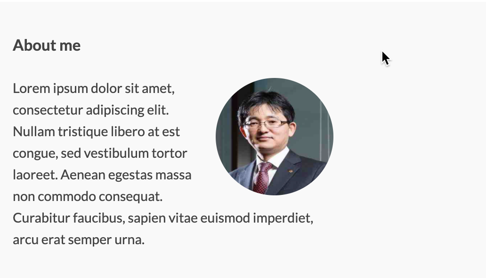

```{r setup, include=FALSE}
knitr::opts_chunk$set(echo = TRUE, 
                      message = FALSE, 
                      warning = FALSE, 
                      collapse = FALSE,
                      fig.align = "center")
knitr::opts_chunk$set(fig.width = 12, fig.height = 9)

library(shiny)
library(htmltools)

xaringanExtra :: use_panelset()
```

```{r tidyverse, echo=FALSE, out.width = "20%", eval=FALSE}
knitr::include_graphics("img/rmarkdown.png")
```

```{r, preface, echo=FALSE}
div(class = "preface", 
    h4("들어가기"),
    "나의 색깔을 넣어야 합니다.!!", br(),
    "템플리트에서 내것이 아닌 냄새를 지워야 하겠죠?!. 기본적인 Look & Feal을 나만의 것으로 만들어 봅니다.")
```

## 이미지 변경

### 아이콘 변경
웹 어플리케이션이나 홈페이지의 웹 페이지 컨텐츠는 브라우저에서 랜더링되어 표현됩니다. 그런데 컨텐츠 외에서 홈페이지나 웹 페이지 정보로서의 역할을 하는 아이콘과 타이틀이 있습니다.

크롬이나 사파이, IE 등의 웹 브라우저별로 차이가 있으겠지만 대체적으로 **페이지 방문 기록**, **북마크 정보**, 혹은 웹 페이지의 **탭 영역**에 정보를 아이콘과 타이틀을 표현해 줍니다.   

온라인 코스는 웹 어플리케이션입니다. 그러므로 아이콘과 타이틀 정보를 가지고 있습니다.

먼저 아이콘을 변경해 볼까요.

Ines 플랫폼 아이콘은 **static** 디렉토리의 **icon.png**로 정의됩니다. 그러므로 변경하려는 아이콘 파일을 대체하면 됩니다.

dlookr 코스를 만든다는 전제로 dlookr 패키지의 로고로 아이콘을 바꾸려 합니다.

<br>

::: {.panelset}

::: {.panel}
#### 변경전 이미지 파일 

```{r icon-ines, echo=FALSE, out.width = "20%"}

```
:::

::: {.panel}
#### 변경할 이미지 파일

```{r icon-dlookr, echo=FALSE, out.width = "20%"}
knitr::include_graphics("img/logo_dlookr.png")
```

:::

:::

<br>

dlookr 로고 파일을  **static** 디렉토리의 **icon.png**로 덮어써버립니다. 그러면 다음과 같은 아이콘의 변화를 인식할 수 있습니다. 구글 크폼 브라우저의 탭 모양 변경을 예시로 들었습니다.


<br>

::: {.panelset}

::: {.panel}
#### 변경 전 아이콘 출력 예시

```{r tab-ines, echo=FALSE, out.width = "80%"}

```
:::

::: {.panel}
#### 변경 후 아이콘 출력 예시

```{r tab-dlookr, echo=FALSE, out.width = "80%"}

```

:::

:::

<br>

"아이콘은 수줍은 미소입니다." 썸네일 수준의 이미지이기 때문에 수줍게 소소한 기능이지만, 의외로 유용합니다. 느끼지 못할 정도로 존재감 없지만, 그 기능을 떠오르면 흐뭇한 미소가 나오니까요.


### 로고 변경

Ines 플랫폼 로고는  **static** 디렉토리의 **logo.svg[^1]**로 정의됩니다. 그러므로 변경하려는 아이콘 파일을 대체하면 됩니다. SVG 포맷만 지원하는 것을 주의해야 합니다.

[^1]: SVG 포맷의 그래픽 파일의 확장자 입니다. SVG(Scalable Vector Graphics) 포맷은 2차원 벡터 그래픽 표현을  위한 그래픽 포멧입니다. 이미지를 확대하거나 축소하여도 픽셀이 깨지지 않고 미려하게 화질이 유지하는 장점이 있습니다. 반면에 파일 용량은 PNG, GIF보다 작습니다.

로고 파일은 반드시 SVG 포맷의 파일이어야 합니다. 그러나 SVG 포맷의 파일을 만드는 것은 PNG, GIF를 만드는 것보다 대중적이지는 않습니다. 만약 SVG 포맷의 그래픽을 만든다면 오픈소스인 잉크스페이프(Inkscape)[^2]를 추천합니다.

[^2]: 잉크스페이프는 Windows, Mac OSX, Linux를 위한 전문적인 벡터 그래픽 편집기입니다. (https://inkscape.org/ko/)

기존에 보유하고 있는 PNG, JPG 파일이 있다면 SVG 포맷의 파일로 변환할 수도 있습니다. 개인적으로 https://www.pngtosvg.com/ 사이트를 추천합니다. 이 사이트에서 PNG, JPG 파일을 SVG 파일로 변환할 수 있습니다. dlookr 로그의 이미지 파일을 몇몇 홈페이지에서 변환을 시도했는데, 이 사이트에서는 컬러 색상을 지원하는 했습니다. 단, 6개 색상 내에서 지원하는 것 같습니다. 


잉크스페이프에 로드한 변경 전후의 로고 파일은 다음과 같습니다.

<br>

::: {.panelset}

::: {.panel}
#### 변경 전 로고 파일

```{r svg-ines, echo=FALSE, out.width = "80%"}

```
:::

::: {.panel}
#### 변경 후 로고 파일

```{r svg-dlookr, echo=FALSE, out.width = "80%"}

```

:::

:::

<br>

로그 파일은 몇몇 군데에 적용됩니다. 그중 초기 화면에 로그 파일이 적용된 코스의 화면은 다음과 같습니다.

::: {.panelset}

::: {.panel}
#### 변경 전 로고 화면

```{r show-ines, echo=FALSE, out.width = "80%"}

```
:::

::: {.panel}
#### 변경 후 로고 화면

```{r show-dlookr, echo=FALSE, out.width = "80%"}

```

:::

:::

<br>


### 강사 사진 변경

온라인 코스이지만, 학습 컨텐트 프로바이더는 분명 강사입니다. Ines 코스 플랫폼에는 강사를 소개하는 섹션이 있고, 강사의 사진을 게시합니다.

Ines 플랫폼 강사 사진은  **static** 디렉토리의 **profile.jpg**로 정의됩니다. 그러므로 변경하려는 아이콘 파일을 대체하면 됩니다. 주의할 것은 이미지 파일의 포맷이 반드시 JPG 파일이어야 합니다. 


변경 전후의 강사 사진은 다음과 같습니다.

<br>

::: {.panelset}

::: {.panel}
#### 변경 전 강사 이미지 파일

```{r profile-ines, echo=FALSE, out.width = "30%"}

```
:::

::: {.panel}
#### 변경 후 강사 이미지 파일

```{r profile-dlookr, echo=FALSE, out.width = "25%"}

```

:::

:::

<br>

변경 전후의 강사 사진은 다음과 같이 표현됩니다. 사진만 변경하였고, 아직 프로파일은 변경하기 전입니다.

<br>

::: {.panelset}

::: {.panel}
#### 변경 전 강사 이미지 적용 화면

```{r profile-ines-2, echo=FALSE, out.width = "80%"}

```
:::

::: {.panel}
#### 변경 후 강사 이미지 적용 화면

```{r profile-dlookr-2, echo=FALSE, out.width = "80%"}

```

:::

:::

<br>


## 코스 정보 변경

### 타이틀 변경
웹 페이지 정보로서의 역할을 하는 아이콘과 타이틀이 있습니다.

크롬이나 사파이, IE 등의 웹 브라우저별로 차이가 있으겠지만 대체적으로 **페이지 방문 기록**, **북마크 정보**, 혹은 웹 페이지의 **탭 영역**에 정보를 아이콘과 타이틀을 표현해 줍니다.   


## 요약 

### 핸즈온 요약

* R 마크다운 문서로 PDF 파일의 문서를 작성했습니다.
* R 마크다운 문서로 워드 파일의 문서를 작성했습니다.
* R 마크다운 문서에 목차를 삽입하고, 그 모양을 바꾸어 보았습니다.

### I can do it

* YAML 헤더를 사용하며, 생성하는 파일의 포맷을 바꾸고 목차 모양을 원하는대로 조정할 수 있습니다.


