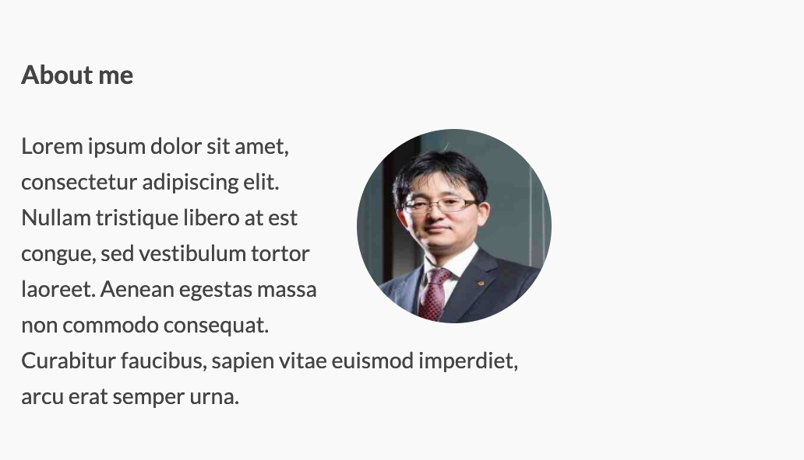

```{r setup, include=FALSE}
knitr::opts_chunk$set(echo = TRUE, 
                      message = FALSE, 
                      warning = FALSE, 
                      collapse = FALSE,
                      fig.align = "center")
knitr::opts_chunk$set(fig.width = 12, fig.height = 9)

library(shiny)
library(htmltools)

xaringanExtra :: use_panelset()
```

```{r, echo=FALSE, eval=TRUE}
p(align = "middle",
  img(src = "img/images_logo.png", width = "20%"),
  img(src = "img/scss-logo.png",   width = "25%")
)
```

```{r, preface, echo=FALSE}
div(class = "preface", 
    h4("들어가기"),
    "나의 색깔을 넣어야 합니다.!!", br(),
    "템플리트에서 내것이 아닌 냄새를 지워야 하겠죠?!. 기본적인 Look & Feal을 나만의 것으로 만들어 봅니다.")
```

## 이미지 변경

### 아이콘 변경
웹 어플리케이션이나 홈페이지의 웹 페이지 컨텐츠는 브라우저에서 랜더링되어 표현됩니다. 그런데 컨텐츠 외에서 홈페이지나 웹 페이지 정보로서의 역할을 하는 아이콘과 타이틀이 있습니다.

크롬이나 사파이, IE 등의 웹 브라우저별로 차이가 있으겠지만 대체적으로 **페이지 방문 기록**, **북마크 정보**, 혹은 웹 페이지의 **탭 영역**에 정보를 아이콘과 타이틀을 표현해 줍니다.   

온라인 코스는 웹 어플리케이션입니다. 그러므로 아이콘과 타이틀 정보를 가지고 있습니다.

먼저 아이콘을 변경해 볼까요.

이네스 플랫폼 아이콘은 **static** 디렉토리의 **icon.png**로 정의됩니다. 그러므로 변경하려는 아이콘 파일을 대체하면 됩니다.

dlookr 코스를 만든다는 전제로 dlookr 패키지의 로고로 아이콘을 바꾸려 합니다.

<br>

::: {.panelset}

::: {.panel}
#### 변경전 이미지 파일 

```{r icon-ines, echo=FALSE, out.width = "20%"}
knitr::include_graphics("img/icon_ines.png")
```
:::

::: {.panel}
#### 변경할 이미지 파일

```{r icon-dlookr, echo=FALSE, out.width = "20%"}
knitr::include_graphics("img/logo_dlookr.png")
```

:::

:::

<br>

dlookr 로고 파일을  **static** 디렉토리의 **icon.png**로 덮어써버립니다. 그러면 다음과 같은 아이콘의 변화를 인식할 수 있습니다. 구글 크폼 브라우저의 탭 모양 변경을 예시로 들었습니다.


<br>

::: {.panelset}

::: {.panel}
#### 변경 전 아이콘 출력 예시

```{r tab-ines, echo=FALSE, out.width = "80%"}

```
:::

::: {.panel}
#### 변경 후 아이콘 출력 예시

```{r tab-dlookr, echo=FALSE, out.width = "80%"}
knitr::include_graphics("img/tab_dlookr.png")
```

:::

:::

<br>

"아이콘은 수줍은 미소입니다." 썸네일 수준의 이미지이기 때문에 수줍게 소소한 기능이지만, 의외로 유용합니다. 느끼지 못할 정도로 존재감 없지만, 그 기능을 떠오르면 흐뭇한 미소가 나오니까요.


### 로고 변경

이네스 플랫폼 로고는  **static** 디렉토리의 **logo.svg[^1]**로 정의됩니다. 그러므로 변경하려는 아이콘 파일을 대체하면 됩니다. SVG 포맷만 지원하는 것을 주의해야 합니다.

[^1]: SVG 포맷의 그래픽 파일의 확장자 입니다. SVG(Scalable Vector Graphics) 포맷은 2차원 벡터 그래픽 표현을  위한 그래픽 포멧입니다. 이미지를 확대하거나 축소하여도 픽셀이 깨지지 않고 미려하게 화질이 유지하는 장점이 있습니다. 반면에 파일 용량은 PNG, GIF보다 작습니다.

로고 파일은 반드시 SVG 포맷의 파일이어야 합니다. 그러나 SVG 포맷의 파일을 만드는 것은 PNG, GIF를 만드는 것보다 대중적이지는 않습니다. 만약 SVG 포맷의 그래픽을 만든다면 오픈소스인 잉크스페이프(Inkscape)[^2]를 추천합니다.

[^2]: 잉크스페이프는 Windows, Mac OSX, Linux를 위한 전문적인 벡터 그래픽 편집기입니다. (https://inkscape.org/ko/)

기존에 보유하고 있는 PNG, JPG 파일이 있다면 SVG 포맷의 파일로 변환할 수도 있습니다. 개인적으로 https://www.pngtosvg.com/ 사이트를 추천합니다. 이 사이트에서 PNG, JPG 파일을 SVG 파일로 변환할 수 있습니다. dlookr 로그의 이미지 파일을 몇몇 홈페이지에서 변환을 시도했는데, 이 사이트에서는 컬러 색상을 지원하는 했습니다. 단, 6개 색상 내에서 지원하는 것 같습니다. 


잉크스페이프에 로드한 변경 전후의 로고 파일은 다음과 같습니다.

<br>

::: {.panelset}

::: {.panel}
#### 변경 전 로고 파일

```{r svg-ines, echo=FALSE, out.width = "80%"}

```
:::

::: {.panel}
#### 변경 후 로고 파일

```{r svg-dlookr, echo=FALSE, out.width = "80%"}
knitr::include_graphics("img/svg_dlookr.png")
```

:::

:::

<br>

로그 파일은 몇몇 군데에 적용됩니다. 그중 초기 화면에 로그 파일이 적용된 코스의 화면은 다음과 같습니다.

::: {.panelset}

::: {.panel}
#### 변경 전 로고 화면

```{r show-ines, echo=FALSE, out.width = "80%"}
knitr::include_graphics("img/show_ines.png")
```
:::

::: {.panel}
#### 변경 후 로고 화면

```{r show-dlookr, echo=FALSE, out.width = "80%"}
knitr::include_graphics("img/show_dlookr.png")
```

:::

:::

<br>


### 강사 사진 변경

온라인 코스이지만, 학습 컨텐트 프로바이더는 분명 강사입니다. 이네스 코스 플랫폼에는 강사를 소개하는 섹션이 있고, 강사의 사진을 게시합니다.

이네스 플랫폼 강사 사진은  **static** 디렉토리의 **profile.jpg**로 정의됩니다. 그러므로 변경하려는 아이콘 파일을 대체하면 됩니다. 주의할 것은 이미지 파일의 포맷이 반드시 JPG 파일이어야 합니다. 


변경 전후의 강사 사진은 다음과 같습니다.

<br>

::: {.panelset}

::: {.panel}
#### 변경 전 강사 이미지 파일

```{r profile-ines, echo=FALSE, out.width = "30%"}
knitr::include_graphics("img/icon_ines.png")
```
:::

::: {.panel}
#### 변경 후 강사 이미지 파일

```{r profile-dlookr, echo=FALSE, out.width = "25%"}

```

:::

:::

<br>

변경 전후의 강사 사진은 다음과 같이 표현됩니다. 사진만 변경하였고, 아직 프로파일은 변경하기 전입니다.

<br>

::: {.panelset}

::: {.panel}
#### 변경 전 강사 이미지 적용 화면

```{r profile-ines-2, echo=FALSE, out.width = "80%"}
knitr::include_graphics("img/profile_ines.png")
```
:::

::: {.panel}
#### 변경 후 강사 이미지 적용 화면

```{r profile-dlookr-2, echo=FALSE, out.width = "80%"}

```

:::

:::

<br>

**이미 `npm run dev` 명령어를 실행해서 개발 서버가 구동된 상태라면 파일을 대체할 때마다 정보가 반영되어 브라우저의 코스 앱에서 이미지가 자동 변경됩니다. 그러나 아이콘이 변경되기 위해서는 개발 서버를 재시작해야 합니다.**


## 코스 정보 변경

### 타이틀 변경

웹 페이지 정보로서의 역할을 하는 아이콘과 타이틀이 있습니다. 이미 앞에서 아이콘을 변경했고, 타이틀을 변경해 보겠습니다.

다음과 같은 **meta.json** 파일에는 코스 앱의 메타 정보가 정의되어 있습니다.

```{r, eval=FALSE, echo=TRUE}
{
    "courseId": "course-starter-r",
    "title": "My cool online course",
    "slogan": "A free online course",
    "description": "Lorem ipsum dolor sit amet, consectetur adipiscing elit. Nullam tristique libero at est congue, sed vestibulum tortor laoreet. Aenean egestas massa non commodo consequat. Curabitur faucibus, sapien vitae euismod imperdiet, arcu erat semper urna, in accumsan sapien dui ac mi. Pellentesque felis lorem, semper nec velit nec, consectetur placerat enim.",
    "bio": "Lorem ipsum dolor sit amet, consectetur adipiscing elit. Nullam tristique libero at est congue, sed vestibulum tortor laoreet. Aenean egestas massa non commodo consequat. Curabitur faucibus, sapien vitae euismod imperdiet, arcu erat semper urna.",
    "siteUrl": "https://course-starter-r.netlify.com",
    "twitter": "spacy_io",
    "fonts": "IBM+Plex+Mono:500|IBM+Plex+Sans:700|Lato:400,400i,700,700i",
    "testTemplate": "success <- function(text) {\n    cat(paste(\"\\033[32m\", text, \"\\033[0m\", sep = \"\"))\n}\n\n.solution <- \"${solutionEscaped}\"\n\n${solution}\n\n${test}\ntryCatch({\n    test()\n}, error = function(e) {\n    cat(paste(\"\\033[31m\", e[1], \"\\033[0m\", sep = \"\"))\n})",
    "juniper": {
        "repo": "ines/course-starter-r",
        "branch": "binder",
        "lang": "r",
        "kernelType": "ir",
        "debug": false
    },
    "showProfileImage": true,
    "footerLinks": [
        { "text": "Website", "url": "https://spacy.io" },
        { "text": "Source", "url": "https://github.com/ines/course-starter-r" },
        { "text": "Built with ♥", "url": "https://github.com/ines/course-starter-r" }
    ],
    "theme": "#de7878"
}

```

<br>

json 데이터 포맷의 **title** name으로 타이틀을 정의합니다.  이 타이틀을 다음과 같이 바꿔봅니다. 타이틀은 탭에 일부만 표현되기 때문에 마우스를 올려 툴팁으로 전체 타이틀이 표현되는 것을 캡쳐해 보았습니다.

<br>

::: {.panelset}

::: {.panel}
#### 변경 전 title

```{r, eval=FALSE, echo=TRUE}
"title": "My cool online course",
```

<br>

```{r before-title, echo=FALSE, out.width = "60%"}

```
:::

::: {.panel}
#### 변경 후 title

```{r, eval=FALSE, echo=TRUE}
"title": "dlookr online course",
```

<br>

```{r after-title, echo=FALSE, out.width = "60%"}

```

:::

:::

<br>

아이콘과 타이틀은 함께 브라우저에 노출됩니다. 아이콘이 적용되기 위해서 개발 서버를 재 시작해야 하는 것처럼 타이틀이 적용되기 위해서도 개발 서버를 재 시작해야 합니다. 엄밀히 말하자면 **meta.json** 파일을 수정할 경우에 그 내용이 자동으로 반영되지 않습니다. 개발 서버를 재가동해야 **meta.json** 파일의 내용이 적용됩니다.

눈썰미 있는 분들은 타이틀과 함께 출력되는 **meta.json** 파일에 기술된 **'A free online course'**이 타이틀과 함께 출력되었음을 발견할 수 있습니다. "slogan"이라는 이름으로 정의된 **슬로건**은 코스의 첫 화면에서 타이틀과 함께 출력됩니다. 

그러나 타이틀은 꼭 슬로건과 함께 출력되는 것은 아닙니다. 다음은 Chapter1에서 출력되는 타이틀을 캡쳐한 그림입니다. '타이틀 + Chapter1 이름'처럼 표현되었습니다.

<br>

```{r chapter1-title, echo=FALSE, out.width = "80%"}

```

### 코스 및 강사 소개 변경

meta.json에서 "description"과 "bio"는 각각 코스 소개  및 강사 소개 글입이다. 이것을 다음처럼 바꿔 봅니다. 주의할 것은, 소개글은 엔터를 삽입해서는 안됩니다. 다소 내용이 길더라도 한 줄로 작성해야 합니다.

<br>

::: {.panelset}

::: {.panel}
#### 변경 전 과정 및 강사 소개

```{r, eval=FALSE, echo=TRUE}
    "description": "Lorem ipsum dolor sit amet, consectetur adipiscing elit. Nullam tristique libero at est congue, sed vestibulum tortor laoreet. Aenean egestas massa non commodo consequat. Curabitur faucibus, sapien vitae euismod imperdiet, arcu erat semper urna, in accumsan sapien dui ac mi. Pellentesque felis lorem, semper nec velit nec, consectetur placerat enim.",
    "bio": "Lorem ipsum dolor sit amet, consectetur adipiscing elit. Nullam tristique libero at est congue, sed vestibulum tortor laoreet. Aenean egestas massa non commodo consequat. Curabitur faucibus, sapien vitae euismod imperdiet, arcu erat semper urna."
```

<br>

```{r before-description, echo=FALSE, out.width = "80%"}
knitr::include_graphics("img/before-description.png")
```
:::

::: {.panel}
#### 변경 후 과정 및 강사 소개

```{r, eval=FALSE, echo=TRUE}
    "description": "이 과정은 R 데이터 분석 과정에서의 데이터의 진단, 탐색적 데이터 분석, 데이터 변환을 수행하는 방법에 대한 무료, 오픈소스 과정입니다. dlookr 패키지를 사용하여 모델 적합 전 단계의 과정에서의 테크닉을 연습합니다. 이네스 몬타니(Ines Montani)는 이 과정을 실행하는 웹 프레임워크를 설계했습니다. 이 과정은 이네스의 프레임워크 기반에서 동작합니다. 이네스에게도 감사의 인사를 전합니다.이 과정을 개선하는 방법에 대한 여러분의 기여와 의견을 환영합니다. 수정하거나 개선이 필요한 이슈를 찾으면 풀 리퀘스트를 제출하세요.",
    "bio": "저는 유충현입니다. Tidiverse Korea에서 활동하는 데이터 과학자로 한화생명 Data Analytics 노드에서 근무하고 있습니다. dlookr 패키지의 개발자이기도 합니다. R과 데이터 분석 교육 컨텐츠 개발에 관심이 많은, R과 데이터를 사랑하는 R 유저입니다.",
```

<br>

```{r after-description, echo=FALSE, out.width = "80%"}

```

:::

:::

<br>

### footer 링크 변경

footer 링크 중에서 개인 홈페이지와 코스 컨텐츠 소스 리파지토리를 다음과 같이 변경합니다. 만약 footer 링크로 사용할 URL이 있다면 추가하거나, 불필요한 링크는 삭제할 수도 있습니다.

```{r, eval=FALSE, echo=TRUE}
    "footerLinks": [
        { "text": "Website", "url": "https://choonghyunryu.github.io/" },
        { "text": "Source", "url": "https://github.com/choonghyunryu/course-starter-dlookr" },
        { "text": "Built with ♥", "url": "https://github.com/ines/course-starter-r" }
    ]
```


## 테마 수정하기

theme.sass는 코스 웹 어플리케이션의 테마를 정의한 파일입니다. SASS(Syntatically Awesome StyleSheets)는 기존 CSS 코드를 좀 더 어썸하게 사용하게 도와주는 도구입니다. 확장자로 'sass'를 사용합니다. 

다음은 theme.sass 파일의 일부입니다.

```{r, eval=FALSE, echo=TRUE}
\:root
    --font-primary: Lato, Roboto, Helvetica, Arial, sans-serif, 'Apple Color Emoji', 'Segoe UI Emoji', 'Segoe UI Symbol'
    --font-display: 'IBM Plex Sans', Roboto, Helvetica, Arial, sans-serif, 'Apple Color Emoji', 'Segoe UI Emoji', 'Segoe UI Symbol'
    --font-code: 'IBM Plex Mono', Menlo, Monaco, Consolas, 'Liberation Mono', 'Courier New', monospace

    // Font Sizes
    --font-size-xs: 1.15rem
    --font-size-sm: 1.3rem
    --font-size-md: 1.5rem
    --font-size-lg: 1.8rem
    --font-size-xl: 2.4rem

    // Line heights
    --line-height: 1.6

    // Colors
    --color-back: #fff
    --color-front: #444
    --color-theme: #de7878
    --color-theme-contrast: #fff
    --color-subtle-dark: #777
    --color-subtle-medium: #eee
    --color-subtle-light: #f9f9f9
    --color-background-code: #7a818117
```

## 테마 색상 변경하기

테마의 사용 방법의 이해를 위해서 컨텐츠의 테마 색상을 변경해 보겠습니다. 테마 색상은 순번을 나타는 머릿기호의 순번, 버튼 등의 색상을 정의합니다. 

theme.sass 파일에 --color-theme로 정의하는 색상을 변경하면 됩니다. RBG 형식의 색상을 사용하면 됩니다. 또한 개발 서버가 구동되어 있을 때, theme.sass이 변경되면 변경 내용이 자동으로 바로 적용됩니다. 

**meta.json 파일의 "theme"도 테마 색상을 지정합니다. 그러므로 테마 색상의 경우는,  meta.json와 theme.sass에서 변경할 수 있습니다.**

<br>

::: {.panelset}

::: {.panel}
#### 변경 전 순번 색상

```{r, eval=FALSE, echo=TRUE}
--color-theme: #de7878
```

<br>

```{r before-theme, echo=FALSE, out.width = "80%"}

```
:::

::: {.panel}
#### 변경 후 순번 색상

```{r, eval=FALSE, echo=TRUE}
--color-theme: #0072bc 
```

<br>

```{r after-theme, echo=FALSE, out.width = "80%"}

```

:::

:::

<br>


## 요약 

### 작업 요약

* 이네스 코스 템플리트의 아이콘 등 이미지 파일을 변경했습니다.
* 이네스 코스 설정파일인 meta.json 파일을 수정했습니다.
* 이네스 코스 테마 파일인 theme.sass 파일을 수정했습니다.

### I can do it

* 이네스 코스 템플리트를 수정해서 강사인 자신의 룩앤필로 변경할 수 있습니다. 


