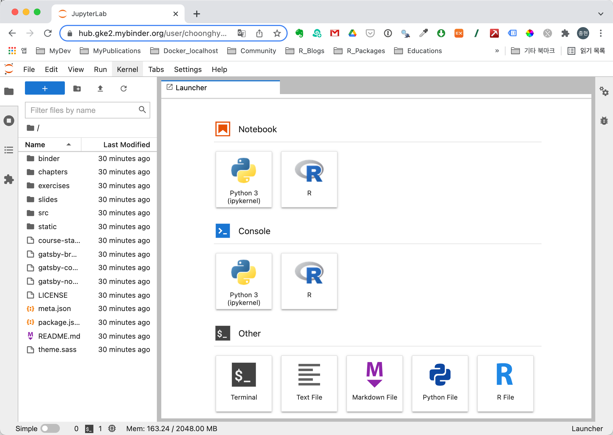

```{r setup, include=FALSE}
knitr::opts_chunk$set(echo = TRUE, 
                      message = FALSE, 
                      warning = FALSE, 
                      collapse = FALSE,
                      fig.align = "center")
knitr::opts_chunk$set(fig.width = 12, fig.height = 9)

library(shiny)
library(htmltools)

xaringanExtra :: use_panelset()
```


```{r, echo=FALSE, eval=TRUE}
p(align = "middle",
  img(src = "img/github-logo.png",  width = "30%"),
  img(src = "img/binder-logo.svg",  width = "35%"),
  img(src = "img/netlify-logo.png", width = "30%")
)
```


```{r, preface, echo=FALSE}
div(class = "preface", 
    h4("들어가기"),
    "강사를 위한 온라인 코스는 아니지요?! 수강할 R 사용자를 위해서 배포해야 합니다.", br(),
    "이제 여러분의 코스를 배포할 일만 남았습니다. 어렵지 않습니다. 시도하지 않았을 뿐이죠.")
```

## 배포를 위한 환경 설정

**meta.json** 파일에는 코스 컨텐츠를 배포하기 위한 설정이 포함되어 있습니다.

### 코스 사이트 URL 변경

코스 사이트 컨텐츠를 배포해서 서비스할 사이트 URL은 다음처럼 meta.json의 "siteUrl"에 기술합니다.

```{r, eval=FALSE, echo=TRUE}
"siteUrl": "https://course-starter-dlookr.netlify.com"
```

코스 서비스는 netlify에 배포하여 서비스를 운영할 것입니다. 그래서 사이트 URL로 [https://course-starter-dlookr.netlify.com](https://course-starter-dlookr.netlify.com)을 지정합니다.

### Binder 연결정보 변경

코스 컨텐츠의 프론트 엔드(Front-End)는 Gatsby 기반으로 구현되었습니다. 그러나 핸즈온을 위한 R 스크립트의 실행, 즉 백 엔드는(Back-End) R이 설치된 환경에서 실행됩니다. 이 환경은 Binder(mybinder.org)에서 도커 기반으로 구성됩니다. 이 구성을 다음과 같이 meta.json에 정의합니다.

"juniper" 섹션에서 변경이 필요한 "repo"를 변경하면 됩니다.  

```{r, eval=FALSE, echo=TRUE}
    "juniper": {
        "repo": "choonghyunryu/course-starter-dlookr",
        "branch": "binder",
        "lang": "r",
        "kernelType": "ir",
        "debug": false
    }
```

개발한 Gihthub 코스 컨텐츠의 Github 리파지토리를 기술합니다. 필자는 템플리트 프로젝트를 'choonghyunryu/course-starter-dlookr'에 저장했기 때문이 이네스의 리파지토리에서 대체합니다. 그리고 'branch'는 'binder'를 유지합니다.


```{r, sol-1, echo=FALSE}
div(class = "bg-orange", 
    h4(icon("lightbulb", style = "margin-right: 5px;"), 
       "솔루션", style = "margin-bottom: 10px; margin-top: 0px;"), 
    "백 엔드 서비스를 위해서 Binder에 연결할 binder 브랜치를 만듭니다. 그리고 프론트 엔드를 위한 브랜치는 master를 사용합니다. 그 이유는 백 엔드는 변경할 일이 없지만, 프론트 엔드는 컨텐츠를 개발하면서 브렌치가 자주 업데이트될 것입니다. 그럴때마다 Binder에서 도커가 컨테이너를 강제로 재 생성하는 오버헤드가 발생합니다. master와 binder 브랜치를 분리하는 이유입니다.")
```

<br>

"kernelType"의 "ir"은 IRKernel[^1]을 의미합니다. 이 커널은  RStudio 없이 Jupyter 환경에서 R을 실행할 수 있는 커널입니다. 

[^1]: Native R kernel for Jupyter (https://github.com/IRkernel/IRkernel)

## Binder 컨테이너 설정

이네스 플랫폼 템플리트의 **binder** 디렉토리에는 다음과 같은 두개의 파일이 존재합니다.

* runtume.txt
* install.R

### runtume.txt 파일 설정

Binder(mybinder.ord)가 **binder** 디렉토리에서 **install.R** 파일을 찾으면, **R이 가능한 환경**의 도커 이미지를 빌드하여 컨테이너를 생성합니다.
그리고, **requirments.txt**라는 이름의 파일을 찾으면, **Python 3**를 포함한 도커 이미지를 빌드하여 컨테이너를 생성합니다. 

마지막으로 컨테이너를 바인딩하여 R이나 Python 스크립트를 컨테이너에서 수행하고 결과를 이네스 플랫폼에 전달합니다.


그러므로 Binder는 R이 가능한 환경의 도커 이미지를 설치합니다. 그리고 설치할 R 환경의 R 패키지 버전은 runtume.txt 파일에서 얻습니다.

runtume.txt 파일은 **'r-YYYY-MM-DD'** 형식의 텍스트를 포함하는데, 이것은 **MRAN(Microsoft R Application Network)의 패키지 스냅샷 버전**을 의미합니다.
CRAN에 대응하여, Microsoft(구 Revolution Analytics)는 2014sus 9월 17일부터 CRAN 패키지를 데일리 스냅샷을 떠서 보관하고 있습니다. 즉 'r-YYYY-MM-DD'는 YYYY-MM-DD 일자에 해당하는 스냅샷에서 패키지를 설치하라는 의미입니다.

템플리트의 runtume.txt 파일은 'r-2019-04-10'로 정의되어 있습니다. dlookr이 2021-12-06에 0.5.4 버전이 CRAN 등록되었으니, 넉넉잡아서 'r-2021-12-10'로 변경합니다.

### install.R 파일 설정

install.R 파일은 R 이미지가 설치된 후 필요한 패키지를 설치할 R 스크립트를 install.R 파일에 기술합니다.

템플리트의 install.R 파일에는 다음과 같이 설정되어 있습니다.

```{r, eval=FALSE, echo=TRUE}
install.packages("tidyverse")
install.packages("rjson")
```

dlookr 코스이므로 다음처럼 dlookr 패키지 설치 코드를 추가합니다.

```{r, eval=FALSE, echo=TRUE}
install.packages("tidyverse")
install.packages("rjson")
install.packages("dlookr")
```


## Github에 코스 컨텐츠 배포하기
Github에 코스 소스를 올리는 작업부터 배포작업이 시작됩니다.

### Github 배포 전략
이네스 코스는의 Github 브랜치는 앞서 Binder 연결정보 변경에서 설명한 대로, 다음 그림과 같이 2개로 배포합니다.[^2]

[^2]: https://github.com/ines/course-starter-r/tree/master 이미지와 본문 참고

```{r repo, echo=FALSE, out.width = "80%"}
knitr::include_graphics("img/repo.png")
```

<br>

#### master 브랜치 리파지토리
프론트 엔드를 담당할 브랜치 리파지토리입니다. Gatsby Javascript 프레임워크를 사용하여 빌드할 페이지로 Netlify에 서비스될 리파지토리입니다. Gatsby는 컨텐츠를 페이지에 랜더링하고, exercises의 코드를 Binder에 보내고 그 결과를 받아서 화면에 처리합니다.

master 브랜치 리파지토리에서 Netlify(Gatsby Javascript)가 처리하는 부분은 다음과 같습니다.

* exercises/solutions/tests
* chapter.md 파일
* slides (reveal.js 이용)

#### binder 브랜치 리파지토리
백 엔드를 담당할 브랜치 리파지토리입니다. Binder에서 도커 컨테이너로 만들어집니다. 브랜치가 업데이트될 때마다 Binder가 컨테이너를 강제로 빌드합니다.

master 브랜치를 Binder와 연결하면 chapter.md 등 컨텐츠들이 수정될 때마가 컨테이너가 다시 빌드됩니다. (Binder가 컨테이너를 빌드하는 작업은 컨테이너에 이미지를 설치하고 소스를 컴파일하는 과정이기 때문에 5~10분 정도의 시간이 소요됩니다.)  그래서 독립적인 binder 브랜치를 만듭니다.

binder 브랜치 리파지토리에서 Binder가 처리하는 부분은 다음과 같습니다.

* data 디렉토리의 데이터 셋
* binder 디렉토리의 설치 설정 파일
     + install.R
     + runtime.txt

### 사전작업

Node.js 패키지를 설치하면서 생성한 package-lock.json 파일을 삭제해서 Github의 리파지토리에서도 삭제토록 합니다. 그리고 여러 작업 과정에서 신규로 생성된 파일 중에서 Github에 올려서는 안될 파일은 이미 이네스가  **.gitignore** 파일에 등록되어서 신경쓰지 않아도 됩니다.

예를 들면 Node.js 패키지를 설치하면서 생성된 **node_modules** 디렉토리와 컨텐츠가 빌드되어 만들어진 **public** 디렉토리가 대표적입니다.

가끔 RStudio에서 R 명령어를 수행할 수 있으므로, .Rhistory 파일을 제외하기 위해서 .gitignore에 다음 내용을 삽입합니다.


```{r, eval=FALSE, echo=TRUE}
# RStudio R history file
.Rhistory
```

### meta.json 수정
마지막으로 meta.json 파일을 다음과 같이 수정했습니다. 사용자의 환경에 맞춰 수정하면 됩니다.

```{r, eval=FALSE, echo=TRUE}
{
    "courseId": "course-starter-dlookr",
    "title": "dlookr online course",
    "slogan": "A free online course",
    "description": "이 과정은 R 데이터 분석 과정에서의 데이터의 진단, 탐색적 데이터 분석, 데이터 변환을 수행하는 방법에 대한 무료, 오픈소스 과정입니다. dlookr 패키지를 사용하여 모델 적합 전 단계의 과정에서의 테크닉을 연습합니다. 이네스 몬타니(Ines Montani)는 이 과정을 실행하는 웹 프레임워크를 설계했습니다. 이 과정은 이네스의 프레임워크 기반에서 동작합니다. 이네스에게도 감사의 인사를 전합니다.이 과정을 개선하는 방법에 대한 여러분의 기여와 의견을 환영합니다. 수정하거나 개선이 필요한 이슈를 찾으면 풀 리퀘스트를 제출하세요.",
    "bio": "저는 유충현입니다. Tidiverse Korea에서 활동하는 데이터 과학자로 한화생명 Data Analytics 노드에서 근무하고 있습니다. dlookr 패키지의 개발자이기도 합니다. R과 데이터 분석 교육 컨텐츠 개발에 관심이 많은, R과 데이터를 사랑하는 R 유저입니다.",
    "siteUrl": "https://course-starter-dlookr.netlify.com",
    "twitter": "bdboy01",
    "fonts": "IBM+Plex+Mono:500|IBM+Plex+Sans:700|Lato:400,400i,700,700i",
    "testTemplate": "success <- function(text) {\n    cat(paste(\"\\033[32m\", text, \"\\033[0m\", sep = \"\"))\n}\n\n.solution <- \"${solutionEscaped}\"\n\n${solution}\n\n${test}\ntryCatch({\n    test()\n}, error = function(e) {\n    cat(paste(\"\\033[31m\", e[1], \"\\033[0m\", sep = \"\"))\n})",
    "juniper": {
        "repo": "choonghyunryu/course-starter-dlookr",
        "branch": "binder",
        "lang": "r",
        "kernelType": "ir",
        "debug": false
    },
    "showProfileImage": true,
    "footerLinks": [
        { "text": "Website", "url": "https://choonghyunryu.github.io/" },
        { "text": "Source", "url": "https://github.com/choonghyunryu/course-starter-dlookr" },
        { "text": "Built with ♥", "url": "https://github.com/ines/course-starter-r" }
    ],
    "theme": "#0072bc"
}
```

<br>

### README 수정하기
코스 컨텐츠의 README.md 파일을 다음과 같이 수정했습니다.

```{r, eval=FALSE, echo=TRUE}
<p align="center">

</p>

# Welcome to the course repo for **[Online course starter: dlookr](https://course-starter-dlookr.netlify.com/)**

You can access [this course for free online](https://supervised-ml-course.netlify.com/).

This course approaches data diagnosis, EDA, transformation learning using:

- the [dlookr](https://choonghyunryu.github.io/dlookr/)

The interactive course site is built on the amazing framework created by [Ines Montani](https://ines.io/), originally built for her [spaCy course](https://course.spacy.io).  The front-end is powered by
[Gatsby](http://gatsbyjs.org/) and the back-end code execution uses [Binder](https://mybinder.org).

[](https://mybinder.org/v2/gh/choonghyunryu/course-starter-dlookr/binder)
[](https://app.netlify.com/sites/course-starter-dlookr/deploys)

To learn more about building a course on this framework, see Ines's starter repos for making courses in [Python](https://github.com/ines/course-starter-python) and [R](https://github.com/ines/course-starter-r), and her explanation of how the framework works at [the original course repo](https://github.com/ines/spacy-course#-faq). 
```

수정한 README.md 파일의 내용 중에는 이후에 설정한 내용이 반영된 것이 포함되어 있습니다. 이 글을 순차적으로 작성하기 위해서, 편의상 후반부의 정보가 본 파일에 포함됨을 인지하시기 바랍니다. 

README.md 파일은 다음 화면처럼 랜더링됩니다. 특히, Binder와 Netflity 배지는 해당 서비스의 상태를 나타내기 때문에 유용합니다. 이 화면은 Github에 변경된 코스 컨텐츠가 Push된 후, 곧바로 변화를 감지한 Netflity에서 서비스를 빌드하는 과정에서의 화면입니다. 만약 빅드가 종료되면 배지의 상태는 **'Building'**에서 **'Success'**로 변경될 것입니다.

```{r readme, echo=FALSE, out.width = "80%"}

```

### 코스 소스 Push하기

수정한 코스 템플리트를 Commit 후 Github에 Push하여 변경 버전을 리파지토리에 배포합니다. 

Push된 Github 리파지토리는 다음과 같습니다.

<br>

```{r github-push, echo=FALSE, out.width = "80%"}

```

<br>

## Mybinder.org 바인딩하기

[Binder 홈페이지(https://mybinder.org/)](https://mybinder.org/)에 방문하여 바인더 이미지를 생성합니다.

다음과 같은 화면에서 Gtubub 리파지토리 정보를 입력합니다.

<br>

```{r binder-setup, echo=FALSE, out.width = "100%"}
knitr::include_graphics("img/binder-setup.png")
```

그리고 공유할 Binder 다음 URL을 복사(메모)해 놓습니다. 

```{r, eval=FALSE, echo=TRUE}
https://mybinder.org/v2/gh/choonghyunryu/course-starter-dlookr/binder
```

<br>

그리고, **launch** 버튼을 눌러 Binder 이미지를 만들어 봅니다. 정상적으로 이미지가 생성되는지 확인하기 위함입니다. 그러면 다음 그림처럼 이미지를 만들기 시작합니다.

<br>

```{r binder-launch, echo=FALSE, out.width = "100%"}
knitr::include_graphics("img/binder-launch.png")
```

<br>
아마 10분 이상 많은 시간에 걸처 이미지를 만들 것입니다. 그리고 정상적으로 이미지가 만들어지만 다음 그림처럼 JupyterLab 화면이 나타납니다.

<br>

```{r jupyterlab, echo=FALSE, out.width = "100%"}

```

<br>

나중에 JupyterLab을 구동하려면, 브라우저 주소창에 앞에서 복사해 놓은 URL을 입력하면 됩니다.


## netlify.com에 서비스 등록하기

### Github 리파지토리 연결

코스 서비스의 사이트 URL은 [https://course-starter-dlookr.netlify.com](https://course-starter-dlookr.netlify.com)로 는 netlify에 등록합니다. 

필자는 netlify.com에 사용자 계정이 있어 로그인하여 다음과 같은 화면을 마주했습니다.

<br>

```{r intro-netflity, echo=FALSE, out.width = "100%"}

```

<br>

**'New site from Git'** 버튼은 눌러서 새로운 사이트를 만듭니다. 그러면 다음과 같은 화면이 나타납니다. 

<br>

```{r git-netflity, echo=FALSE, out.width = "100%"}

```

<br>

**'Github'** 버튼은 눌러서 Github으로부터 사이트를 생성합니다. 

<br>

```{r dlookr-netflity, echo=FALSE, out.width = "100%"}

```

<br>

사이트를 생성할 course-starter-dlookr 리파지토리를 찾아 연결합니다. 

### 사이트 빌드하기

사이트를 배포하기 위한 설정을 다음처럼 입력합니다.

<br>

```{r set-netflity, echo=FALSE, out.width = "100%"}

```

<br>

**branch**에는 **'master'**를 선택합니다. 그리고, Gatsby를 빌드할 설정은 netflity에서 설정한 기본 값을 그대로 사용합니다.

**중요한 것은 이네스의 코스 플랫폼이 3년 전에 만든 것이라 Node.js의 버전을 그 시점의 버전으로 설정하지 않으면 빌드 시 오류가 발생합니다.**

위 화면에서 **'Show advanced'** 버튼을 누르면 다음 화면이 나타납니다. 

<br>

```{r newvariable-netflity, echo=FALSE, out.width = "100%"}
knitr::include_graphics("img/newvariable-netflity.png")
```

<br>

여기서 **'New variable'** 버튼을 누르면 다음 화면이 나타납니다.

<br>

```{r advance-netflity, echo=FALSE, out.width = "100%"}
knitr::include_graphics("img/advance-netflity.png")
```

<br>

2021년 12월 기준으로 Node.js 버전의 17.X.X가 사용됩니다. 필자의 환경도 17.2.0 환경이며, netflity도 17.X.X 버전이 사용됩니다. 그래서 이네스 플랫폼을 빌드할 때 에러가 발생합니다.

**NODE_VERSION** 변수에 14를 입력하면 14.X.X 버전의 Node.js 버전으로 빌드되어 에러가 발생하지 않습니다. 해당 설정의 입력하고 **'Deploy site'** 버튼을 누르면 다음처럼 배포가 시작됩니다.

<br>

```{r deploy-netflity, echo=FALSE, out.width = "100%"}

```

<br>

정상적으로 빌드되면 다음과 같은 화면이 나타납니다. 사이트 URL은 사이트 생성 시 만들어진 사이트 ID의 조합으로 만들어집니다. 이 것은 임의로 생성된 URL입니다.

```{r done-netflity, echo=FALSE, out.width = "100%"}
knitr::include_graphics("img/done-netflity.png")
```

<br>

### 서비스 URL 설정하기

이미 앞에서 [https://course-starter-dlookr.netlify.com](https://course-starter-dlookr.netlify.com)을 사이트 URL로 정하고, **meta.json**에도 해당 URL을 설정했습니다.

서비스 URL을 변경하기 위해서 앞 화면에서 **'Domain settings'** 버튼을 누릅니다. 그러면 다음 그림처럼 좌측 메뉴 바에서 **'Domain management'**를 누른 후, Custom domain 화면에서 **'Options'**와 **'Edit site name'**을 차례로 선택합니다.

<br>

```{r custom-domain, echo=FALSE, out.width = "100%"}

```

<br>

**'Change site name'** 다이얼로그 창이 팝업되면,

<br>

```{r before-domain, echo=FALSE, out.width = "100%"}
knitr::include_graphics("img/before-domain.png")
```

<br>

**'site name'**의 값을 **'course-starter-dlookr'**로 변경 후 **'Save'** 버튼을 누릅니다.

<br>

```{r after-domain, echo=FALSE, out.width = "100%"}
knitr::include_graphics("img/after-domain.png")
```

<br>

이제 모든 설정이 끝났습니다.

## 코스 URL 접속하기

### 접속 확인하기

이제  [https://course-starter-dlookr.netlify.com](https://course-starter-dlookr.netlify.com)을 브라우저에 입력하고 정상적으로 서비스가 동작하는지 확인합니다.

다음 화면처럼 정상적으로 서비스가 구동되었습니다.

<br>

```{r course-netflity, echo=FALSE, out.width = "100%"}
knitr::include_graphics("img/course-netflity.png")
```

### Binder 연결 확인하기

서비스가 Binder에 정상적으로 연결되는 것을 확인하기 위해서는 연습문제를 풀어야 합니다. 그래야 R 스크립트가 Binder의 도커 컨테이너에서 정상적으로 수행되는지 알 수 있습니다.

'Chapter 1: Getting started' > '3. First steps'에는 연습문제 예제가 있습니다. 이 화면에서 **'Show solution'** 버튼을 누르면 다음 그림과 같은 완성된 R 스크립트를 만나게 됩니다.

<br>

```{r exercise, echo=FALSE, out.width = "100%"}
knitr::include_graphics("img/exercise.png")
```

<br>

이 화면에서 **'Run Code'** 버튼을 누르면 해당 R 스크립트들이 Binder에 전송되어 도커 컨테이너를 생성 후, 실행됩니다.

도커 컨테이너이너를 생성하는 대기 시간에는 다음 그림처럼 OUTPUT 창에  "Launching docker container on mybinder.org..."라는 메시지가 나타납니다. 처음 연습문제를 실행할 때만 어느 정도 대시기간이 소요됩니다만, 이후에는 바로 응답합니다. 도커 컨테이너는 처음 접속한 후 세션이 유지될 때까지 구동되므로, 무리없이 학습할 수 있습니다.

<br>

```{r run-exercise, echo=FALSE, out.width = "100%"}
knitr::include_graphics("img/run-exercise.png")
```

<br>

도커 컨테이너에 생성되면, 연습문제 R 스크립트가 실행되고 다음처럼 결과가 OUTPUT 창에 출력됩니다.

<br>

```{r done-exercise, echo=FALSE, out.width = "100%"}

```

<br>

이제 Binder에도 정상적으로 서비스가 등록되어 구동됨을 확인했습니다. 코스 서비스를 위한 모든 작업을 마쳤습니다. Netflity + Github + Binder를 이용해서 무료로 온라인 대화형 코스 서비스를 제공할 수 있게 되었습니다.


## 요약 

### 작업 요약

* Github에 코스 템플리트 수정 버전을 Push하였습니다.
* Binder(mybinder.org)에 R 학습을 위한 도커 컨테이너 환경을 구축했습니다.
* Netflity에 온라인 코스 사이트를 개설했습니다.

### I can do it

* 이네스 플랫폼에 코스를 개발할 수 있는 제반 설정을 수행할 수 있습니다. 
* Netflity + Github + Binder를 이용해서 무료로 온라인 대화형 코스 서비스를 배포할 수 있습니다.


