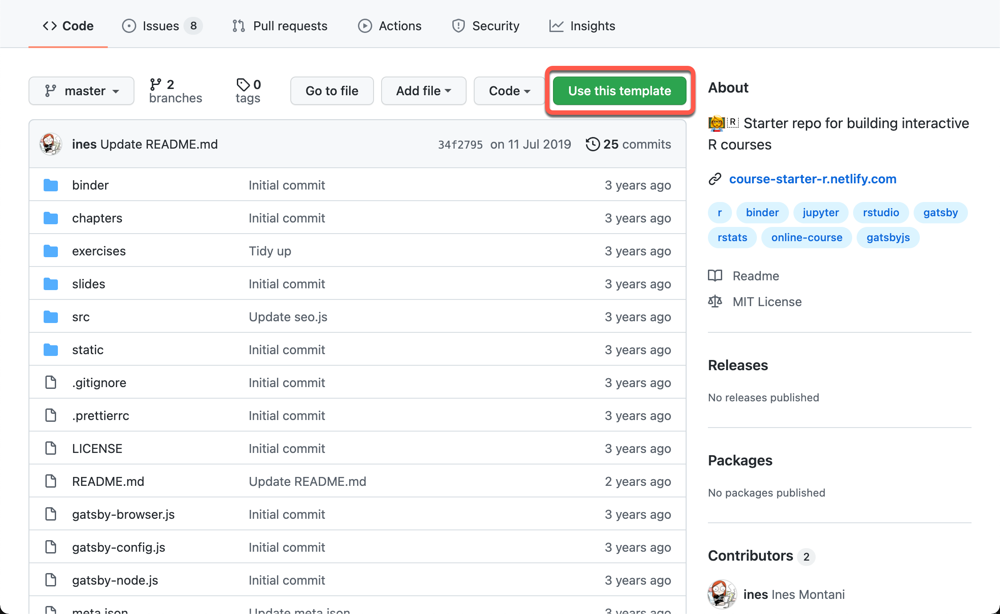
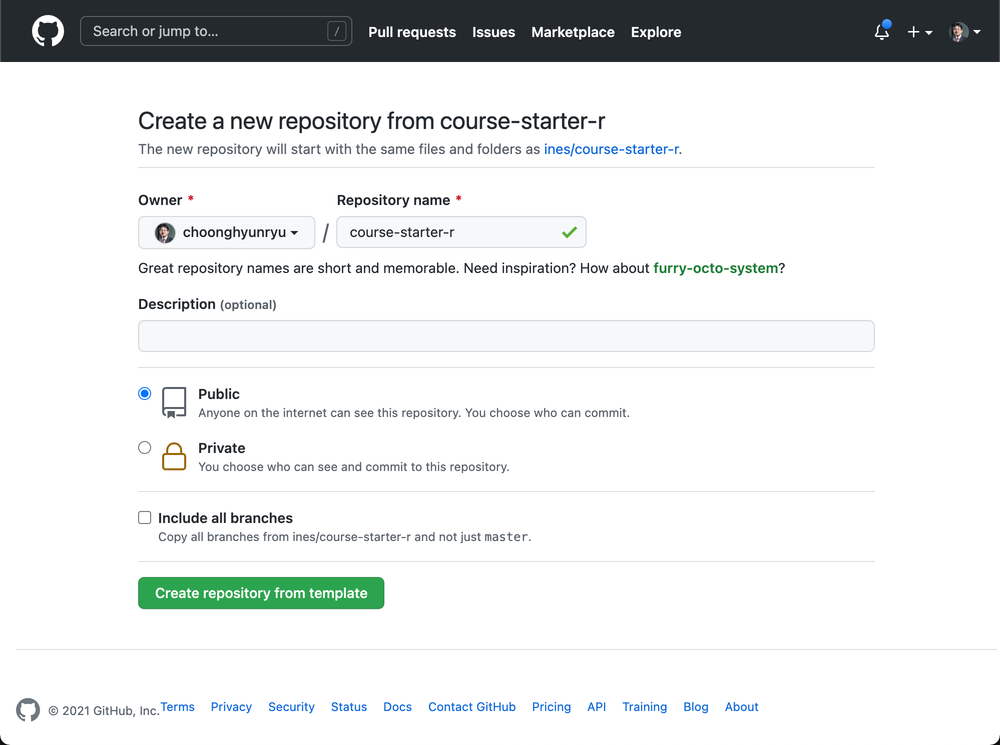
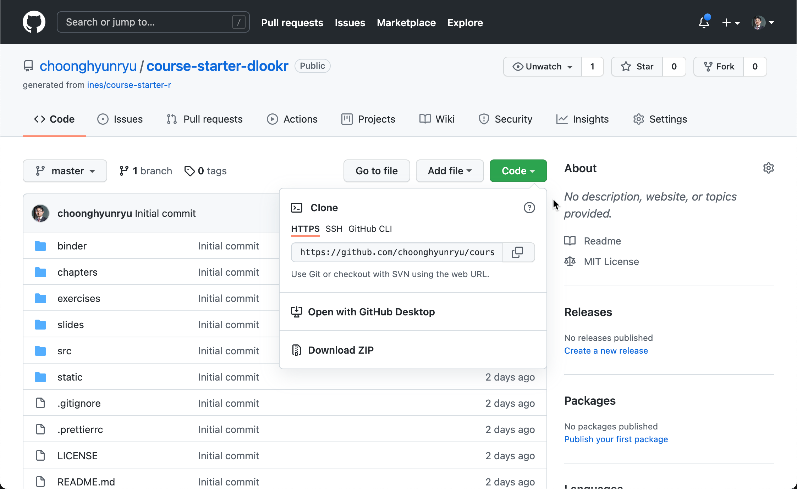
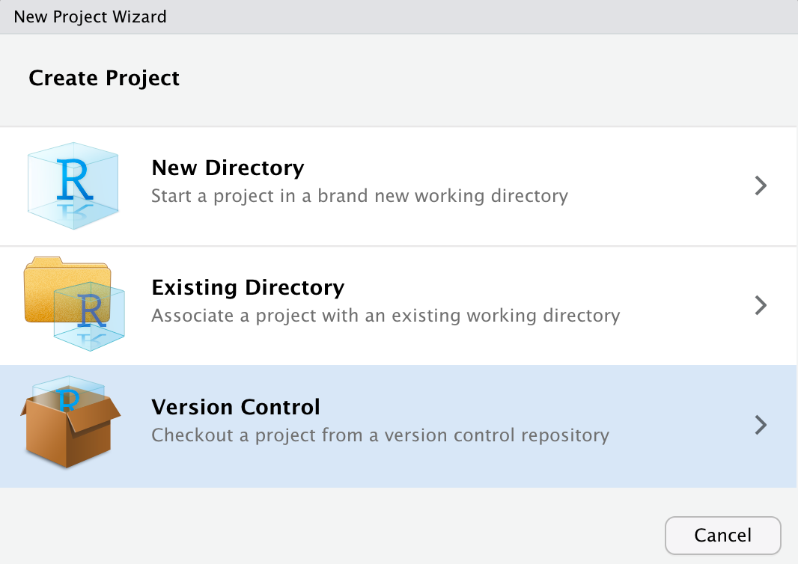
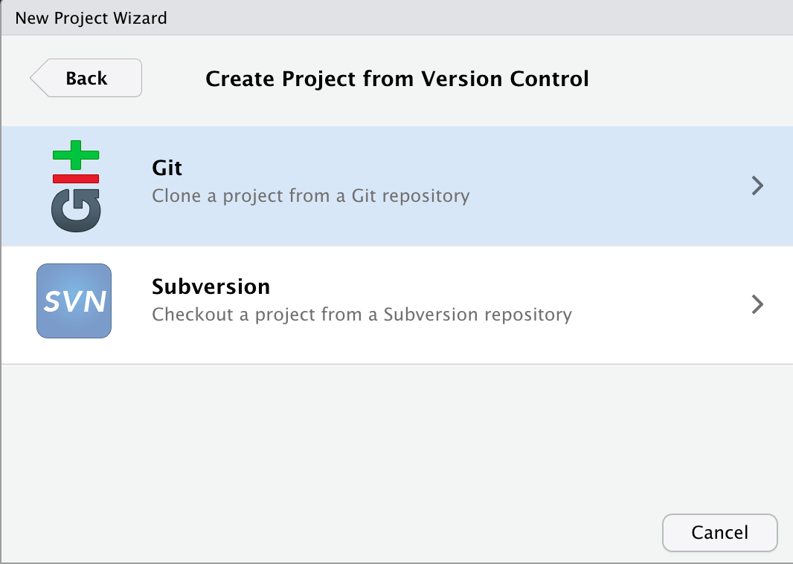
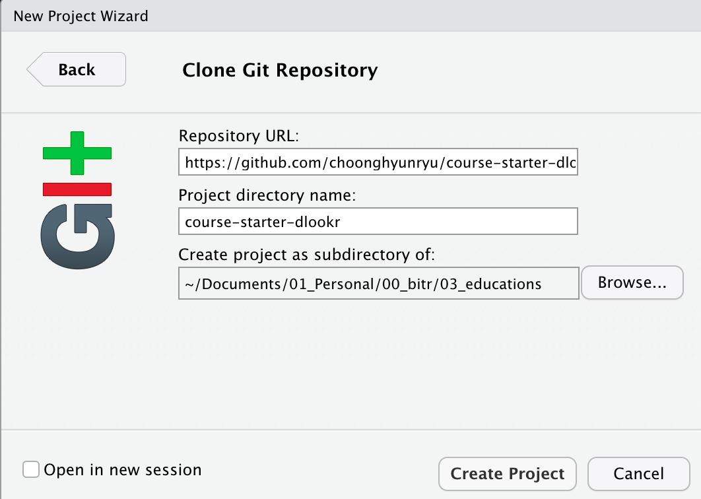
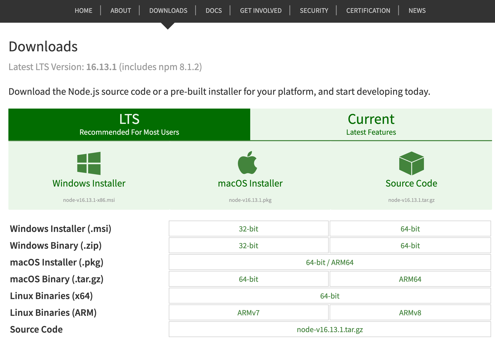

```{r setup, include=FALSE}
knitr::opts_chunk$set(echo = TRUE, 
                      message = FALSE, 
                      warning = FALSE, 
                      collapse = FALSE,
                      fig.align = "center")
knitr::opts_chunk$set(fig.width = 12, fig.height = 9)

library(shiny)
library(htmltools)

xaringanExtra :: use_panelset()
```

```{r, echo=FALSE, eval=TRUE}
p(align = "middle",
  img(src = "img/Node.js_logo.png", width = "25%"),
  img(src = "img/gatsby-logo.png",  width = "40%")
)
```

```{r, preface, echo=FALSE}
div(class = "preface", 
    h4("들어가기"),
    "온라인 코스 50% 한번에 만들기", br(),
    "시작이 반이라는 말이 있죠?!. 이네스로 온라인 R 코스를 만드는 작업을 시작했으니 반을 만든 것이라 보겠습니다.", br(),
    "코스 개발 환경을 만들테니까요.")
```

## 코스 템플리트 설치하기
이네스는 코스 플랫폼을 만든 이네스는 R 강사를 위해서, **"Online course starter: R"**을 배포하고 있습니다. 일종의 이네스 코스 템플리트인 셈입니다.

### Online course starter: R 리파지토리 가져오기

Github의 https://github.com/ines/course-starter-r 리파지토리는 이네스의 코스 플랫폼을 R코스로 사용할 수 있는 템플리트의 리파지토리입니다.

이 URL을 방문하면 다음 그림처럼 **"Use this template"** 버튼이 있습니다.

```{r course-starter-r, echo=FALSE, out.width = "80%"}

```

<br>

이 버튼을 누르면 탬플리트를 가져다가, Github 사용자의 새로운 리파지토리를 생성하는 영역의 웹 페이지로 이동합니다.
dlookr 패키지의 사용 방법을 강의하는 코스를 만들려고 합니다. 그래서 그림처럼 리파지토리의 이름을 "course-starter-dlookr"로 만들었습니다.

<br>

```{r create-repo, echo=FALSE, out.width = "85%"}

```

<br>

## RStudio 프로젝트 생성하기

온라인 코스는 RStudio 환경에서 개발합니다. CLI 환경에서도 가능하지만, 생산성을 위해서 RStudio에서 작업하는 것이 좋습니다.

사용자 Github 리파지토리에 "course-starter-dlookr"가 만들어졌습니다. 다음 그림처럼 Git URL을 복사합니다. RStudio에서 프로젝트를 만들기 위함입니다.

<br>

```{r copy-url, echo=FALSE, out.width = "80%"}

```

<br>

RStudio에서 프로젝트를 생성합니다. 프로젝트 생성을 선택하면 다음과 같이 프로젝트 생성 위자드가 나타납니다.

<br>

```{r create-project, echo=FALSE, out.width = "50%"}

```

<br>

위자드에서 **"Version Control"**에서 **"Git"**을 선택합니다.

```{r version-control, echo=FALSE, out.width = "50%"}

```

<br>

위자드에서 **"Clone Git Repository"**의 **"Repository URL"**에 앞에서 복사한 Git URL을 입력한 후 프로젝트를 만들 경로를 지정하고 프로젝트를 생성합니다.

<br>

```{r clone-git, echo=FALSE, out.width = "50%"}

```

<br>


## 개발 환경 구축하기

Node.js, Gatsby 등 JavaScript 라이브러리를 설치합니다. 
이 글에서는 간단한 기본 설치 방법을 제시하니, 설치 시 문제가 발생하면 검색을 통해서 자세한 설치 방법과 트러블슈팅을 소개하는 페이지를 참고하시기 바랍니다. 

### MS-Windows 운영체제

#### Node.js 설치

https://nodejs.org/en/ 홈페이지를 방문하여 설치 파일을 다운로드 한 후 설치합니다.

이 글을 작성할 시점의 버전은 다음과 같습니다. 원하는 버전을 다운로드하여 설치하시기 바랍니다.

<br>

```{r node-bin, echo=FALSE, out.width = "80%"}

```

<br>

#### Gatsby 설치

터미널에서 Node.js 패키지 관리자인 **npm**을 이용해서 설치합니다.

```{r, eval=FALSE, echo=TRUE}
npm install -g gatsby-cli
```


### macOs 운영체제

#### Node.js 설치

터미널에서 **brew**로 설치합니다. 그래서 먼저 Homebrew를 설치합니다.
설치되어 있으면 건너뛰세요.

```{r, eval=FALSE, echo=TRUE}
/usr/bin/ruby -e "$(curl -fsSL https://raw.githubusercontent.com/Homebrew/install/master/install)"
```

Node.js를 설치하고 설치된 버전을 확인합니다. **npm**도 함께 설치되는데, 이것은 Node.js 패키지를 설치하고 관리하는 유틸리티입니다.

```{r, eval=FALSE, echo=TRUE}
brew install node

node -v
npm - v
```

#### Gatsby 설치

Node.js 패키지 관리자인 **npm**을 이용해서 설치합니다.

```{r, eval=FALSE, echo=TRUE}
npm install -g gatsby-cli
```

macOs 운영체제에서는 **brew**로도 설치가 가능합니다.

```{r, eval=FALSE, echo=TRUE}
brew install gatsby-cli
```


### Linux 운영체제
우분투 리눅스에 한정해서 설명합니다.

#### Node.js 설치

터미널에서 **apt-get**로 설치합니다. 주의할 것은 macOs에서 Node.js는 node로 통용되었는데 리눅스에서는 풀 이름인 "nodejs"를 사용한다는 점과 npm도 별도로 설치한다는 점입니다.

```{r, eval=FALSE, echo=TRUE}
sudo apt-get update
sudo apt-get install nodejs
sudo apt-get install npm
```

버전을 확인해 봅니다.

```{r, eval=FALSE, echo=TRUE}
nodejs -v
npm - v
```

#### Gatsby 설치

Node.js 패키지 관리자인 **npm**을 이용해서 설치합니다.

```{r, eval=FALSE, echo=TRUE}
npm install -g gatsby-cli
```


## 요약 

### 작업 요약

* 이네스 코스 템플리트를 가져다 Github 리파지토리에 코스 개발용 리파지토리를 만들었습니다.
* Github 리파지토리와 연동한 RStudio 프로젝트를 만들었습니다.
* Node.js와 Gatsby JavaScript 라이브러리를 설치했습니다.

### I can do it

* 이네스 코스를 개발할 수 있는 환경을 구축할 수 있습니다.
* 앞으로는 이네스 코스 템플리트를 사용하지 않고, RStudio 프로젝트를 이용해서 새로운 코스 템플리트를 만들 수 있습니다.

