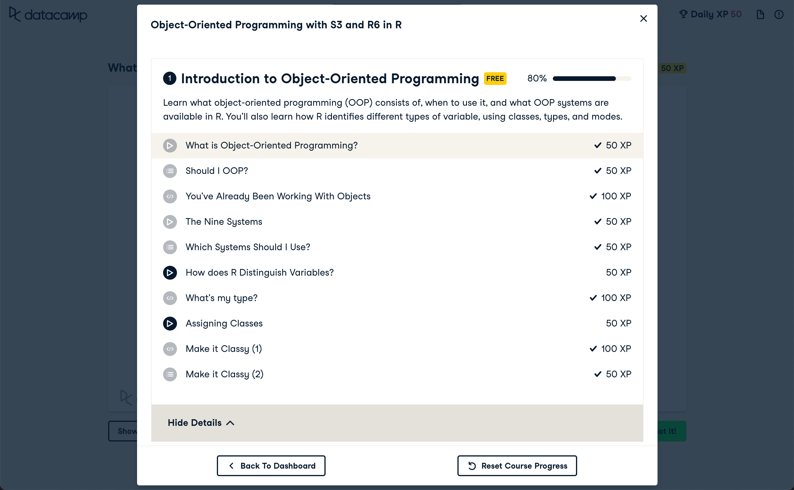
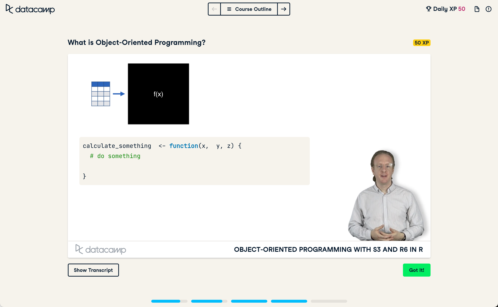
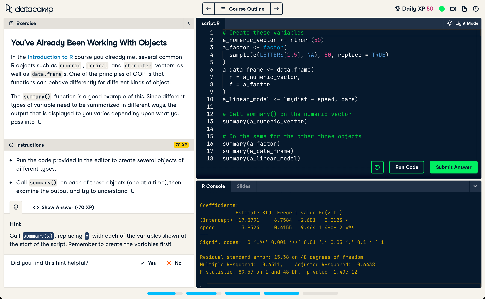
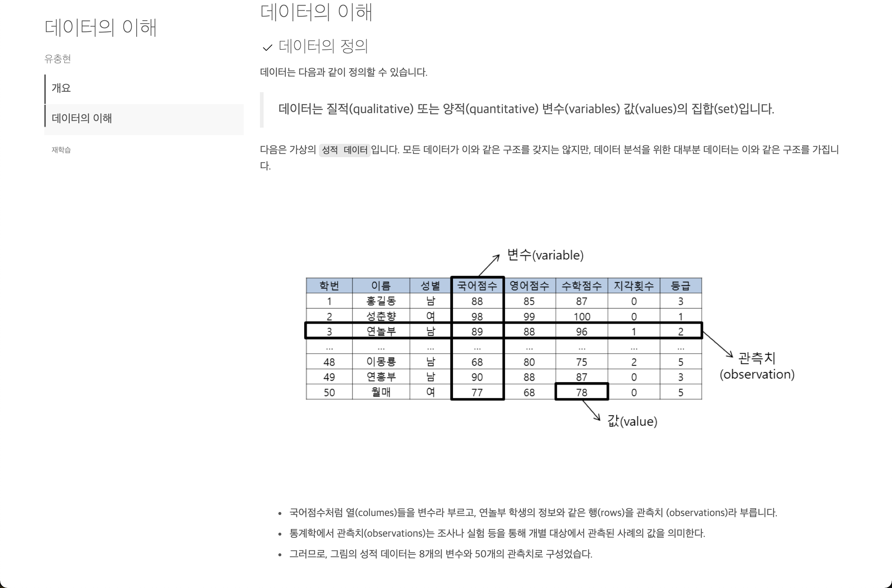
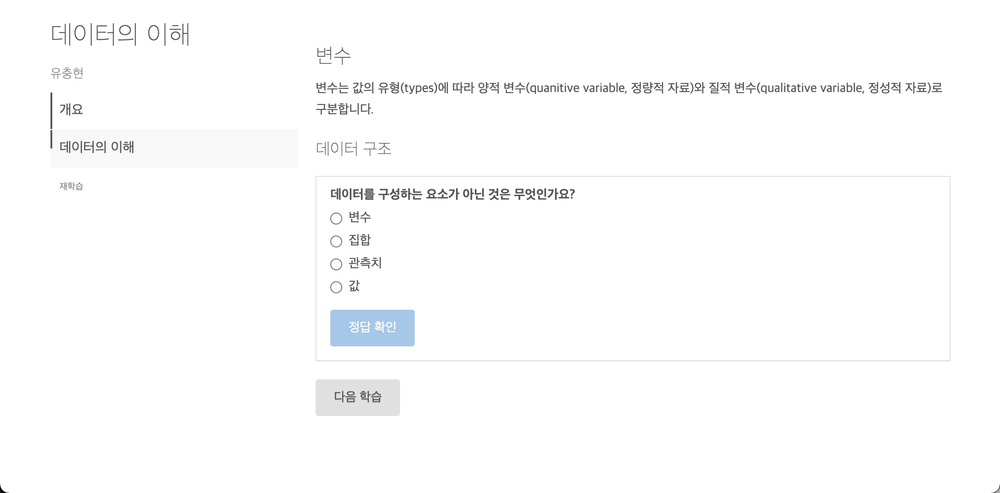
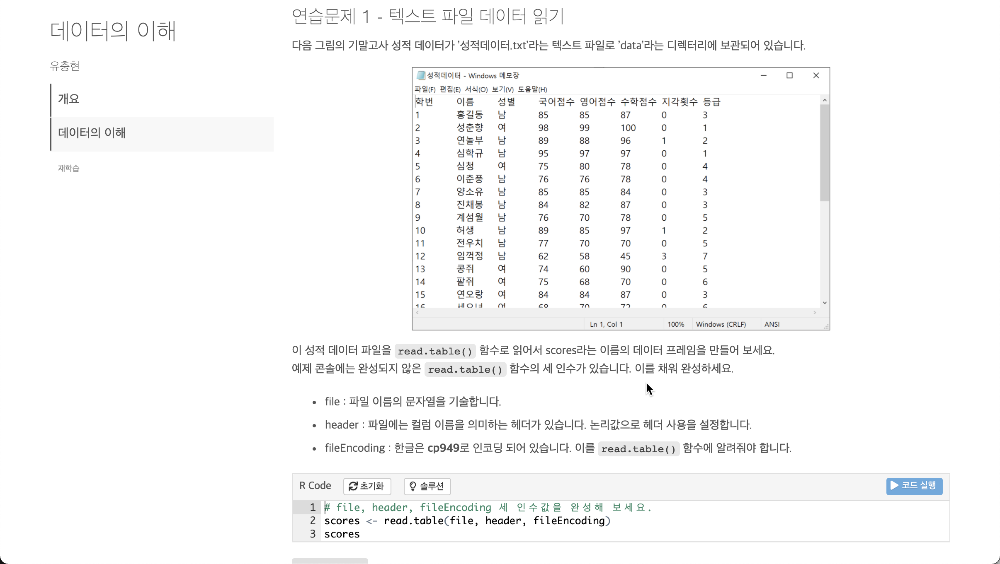
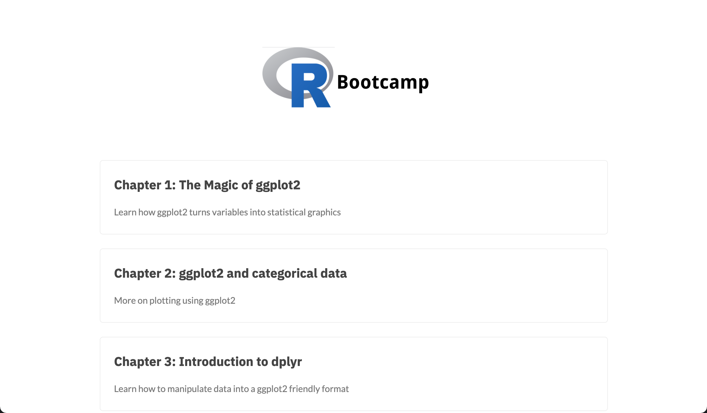
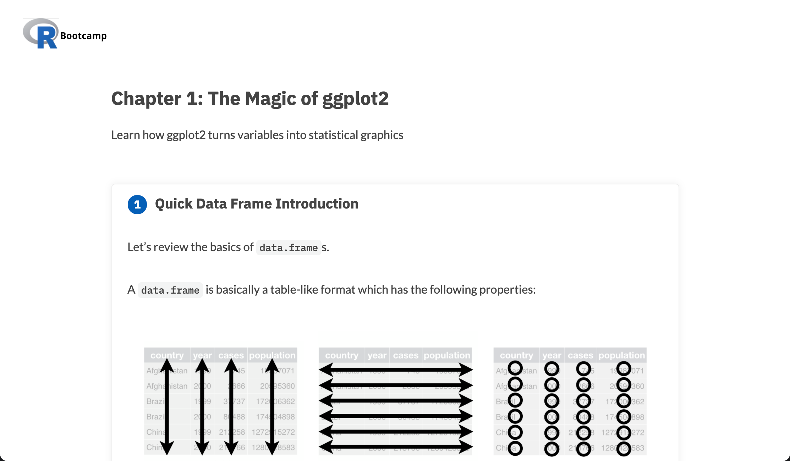
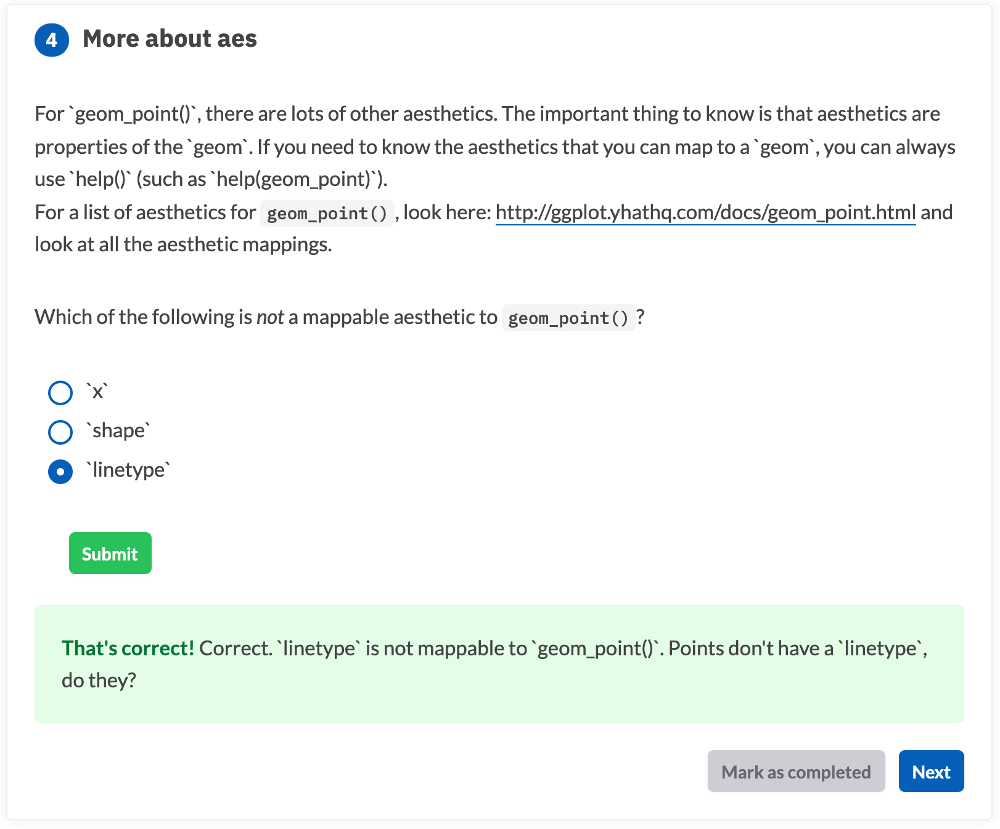
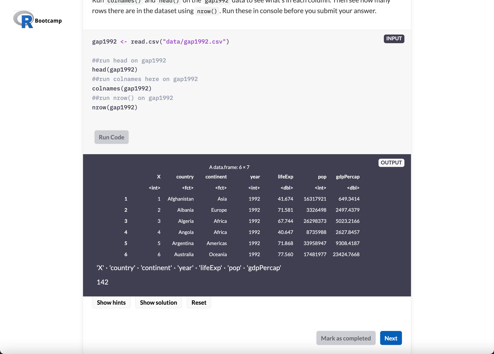

```{r setup, include=FALSE}
knitr::opts_chunk$set(echo = FALSE)
```

## 온라인 대화용 코스 플랫폼
온라인 대화용 코스 플랫폼(interactive course platform)의 장점은 사용자가 R 환경을 구축하지 않아도 R 학습을 수행할 수 있는 장점이 있습니다. 사용자들의 운영체제의 종류와 버전이 다르고, R 과 패키지들의 버전이 달라도 문제가 되지 않습니다. 이것은 중요한 시사점입니다. 
R 온라인 코스 플랫폼은 R 초심자가 어렵게 R을 설치하고 패키지를 설치하지 않아도 학습할 수 있는 일관된 환경을 제공합니다.

### 대화형 학습
강사 없이 학습해야 하기 때문에 온라인 코스 플랫폼은 대화형(interactive) 학습을 지향합니다. 자기 주도형으로 강의를 수강하고, 실습을 위해 직접 R 스크립트를 입력하고 결과를 확인합니다. 힌트와 정답 제공은 핸즈온(hands-on) 학습의 성취도를 높이기 위한 필수 도구입니다. 스스로 학습할 수 있는 가이드를 제공합니다.

### 코스 플랫폼 종류
R 코스 플랫폼에는 데이터캠프, learnr, 이네스 몬타니의 코스 플랫폼이 있습니다. 그리고 또다른 플랫폼이 만들어질 수도 있습니다. 

## DataCamp(데이터캠프)
[DataCamp(데이터캠프)](https://app.datacamp.com/){target="_blank"}는 온라인 데이터 과학 교육을 비즈니스로 하는 스타트업입니다. 일부 무료 코스가 있으나 다수의 유로 온라인 학습 컨텐츠를 보유하고 있습니다.

R 코스 플랫폼은 데이터캠프(DataCamp)가 선두 주자입니다. 개인적으로는 뒤늦게 CEO의 성추행 사건을 접했지만, 데이터캠프가 데이터 과학자와 R/Python 분석가 양성에 기여했음은 인정해야할 것 같습니다.

### 코스 구성

다음은 R의 객체지향형 언어에 대한 코스의 구성 중 일부입니다. 제목 앞의 아이콘을 통해서 동영상 강의와 실습이 포함됨을 알 수 있습니다. 



### 동영상 강의

데이터캠프의 강의 자료는 강사의 동영상을 컨텐츠로 제공됩니다. 오프라인 강의가 아니기 때문에 반복 학습, 되돌리기, 거너뛰기가 가능합니다.



### 핸즈온 학습

핸즈온 학습은 R코드를 작성하고 실행하고, 제출하여 평가를 받습니다. 힌트를 제공해서 정답 스크립트를 작성할 수 있도록 도와줍니다. 




## learnr
shiny 환경에서 구동되는 learnr은 R 마크다운 기반으로 대화형 튜토리얼을 만들수 있는 R 패키지입니다. learnr을 이용하면 쉽게 대화용 코스를 만들 수 있습니다.

learnr은 데이터캠프처럼 동영상 컨텐츠를 포함할 수 있습니다. 그리고 퀴즈 및 Exercise를 지원합니다.

### R 마크다운 기반의 컨텐츠

R 마크다운 문서로 강의 컨텐츠를 작성할 수 있습니다. 



### 퀴즈

learnr은 간단한 퀴즈를 낼수 있는 기능을 제공합니다. 학습 내용의 숙지를 간단하게 체크할 수 있는 유용한 기능입니다.




### 핸즈온 학습

핸즈온 학습은 R코드를 작성하고 실행합니다. 힌트를 제공할수도 있으며, 정답을 제시하기도 합니다. 




## 이네스 몬타니의 코스 플랫폼

데이터캠프와 결별한 코스 컨텐츠 프로바이더들 중의 이네스 몬타니(Ines Montani)가 개발한 코스 플랫폼입니다. (이하 이네스 플랫폼)

데이터 캠프에 제공하던 코스 컨텐츠를 구현하기 때문에 기능은 데이터캠프와 동일합니다.

대표적인 코스 컨텐츠에 **RBootcamp**가 있습니다.

### 컨텐츠 목록 

다음은 Rbootcamp 컨텐츠 목록의 일부입니다.




### 강의 컨텐츠

다음은 Rbootcamp 강의 컨텐츠의 일부입니다.



### 퀴즈

이네스 플랫폼도 퀴즈를 낼수 있는 기능을 제공합니다. 학습 내용의 숙지를 간단하게 체크할 수 있는 유용한 기능입니다. learnr과 유사합니다.




### 핸즈온 학습

핸즈온 학습은 R코드를 작성하고 실행합니다. 힌트를 제공할수도 있으며, 정답을 제시하기도 합니다. 




## 컨텐츠 소개

본 컨텐츠는 **R 강사**들이 **대화형 온라인 R 코스를 개발**하는 것을 도와줄 **가이드**로 다음과 같이 구성되었습니다.

컨텐츠는 이네스 코스 플랫폼의 소개 컨텐츠입니다. learnr 코스 플랫폼은 R 기반의 코스 플랫폼을 소개하는 목적으로 개괄적인 소개만 다룹니다. 


* learnr 코스 플랫폼 이해
  + learnr 코스 플랫폼 도움말 소개 
* 이네스 코스 플랫폼 이해
  + 이네스 코스 플랫폼 도움말 소개 
* 이네스 코스 개발하기
  + 코스 개발환경 구축하기
    + 코스를 개발하기 위한 사용자 개발 환경 구축 방법 소개
  + 코스 템플리트 실행하기
    + 코스를 개발하는 과정에서, 컨텐츠 작성 및 실행하는 방법 소개
  + 코스 커스트마이징하기
    + 코스를 커스트마이징하여, 강사만의 Look & Feal을 만들 수 있는 방법 소개 
  + 코스 서비스 배포하기
    + 개발된 코스 컨텐츠를 배포하여, 수강자가 학습할 수 있는 환경을 구축하는 방법 소개
  + Resources
    + R 코스 플랫폼 관련 리소스  

