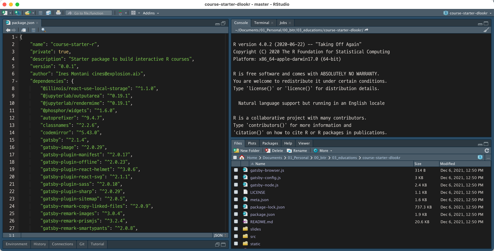
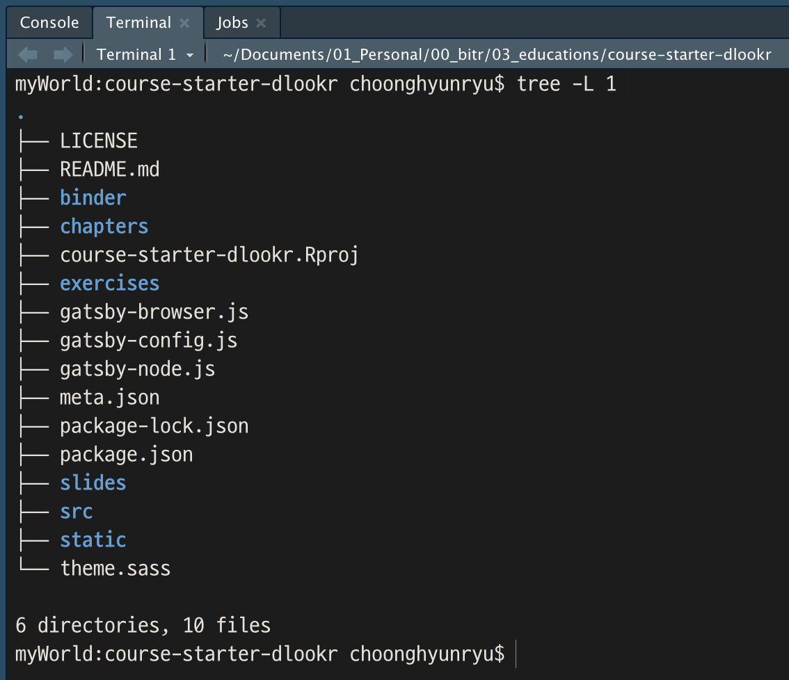
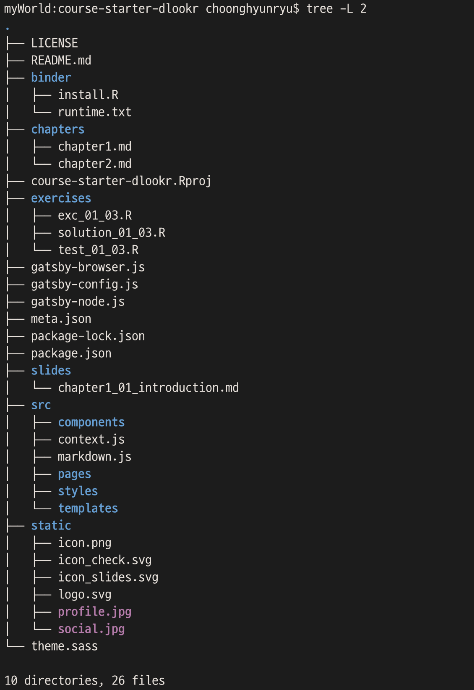
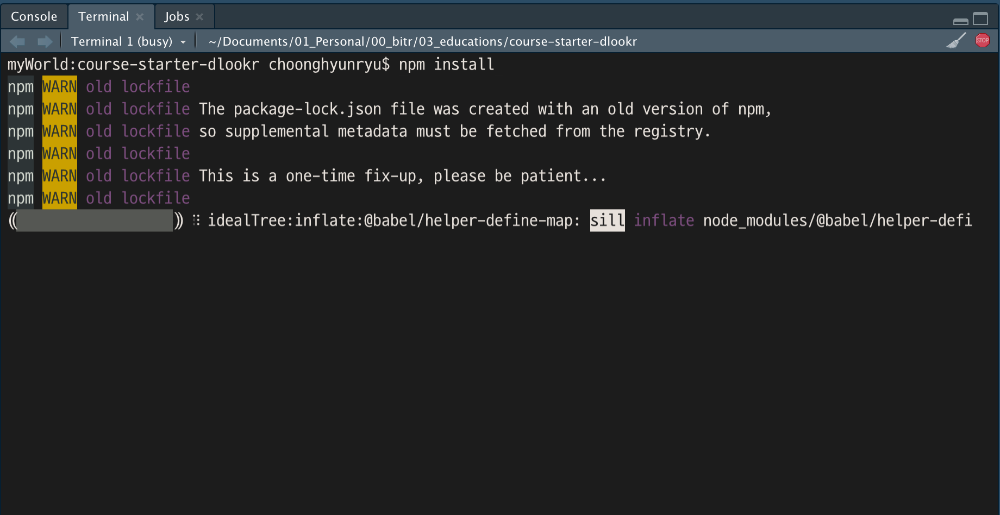
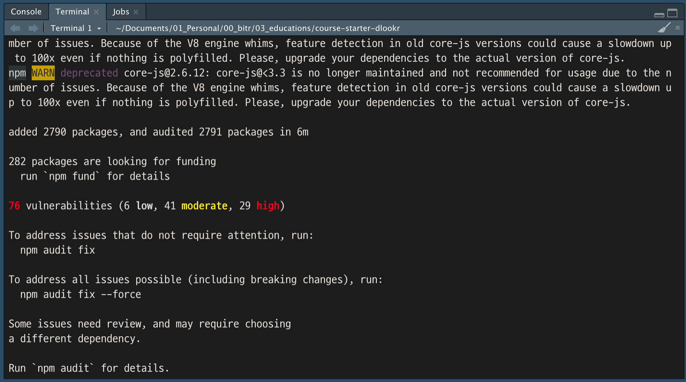
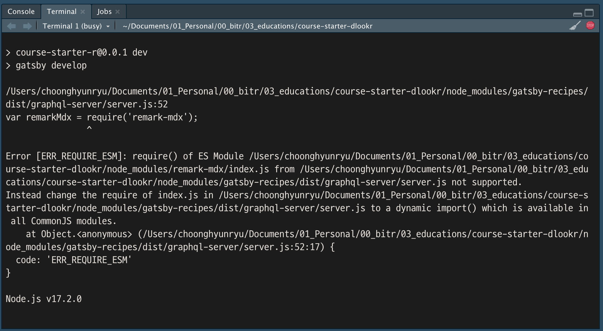
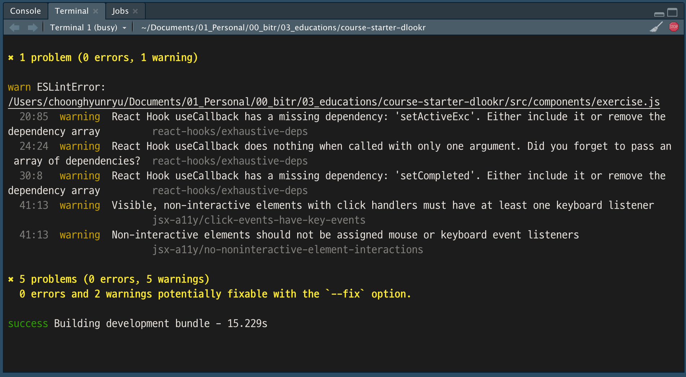
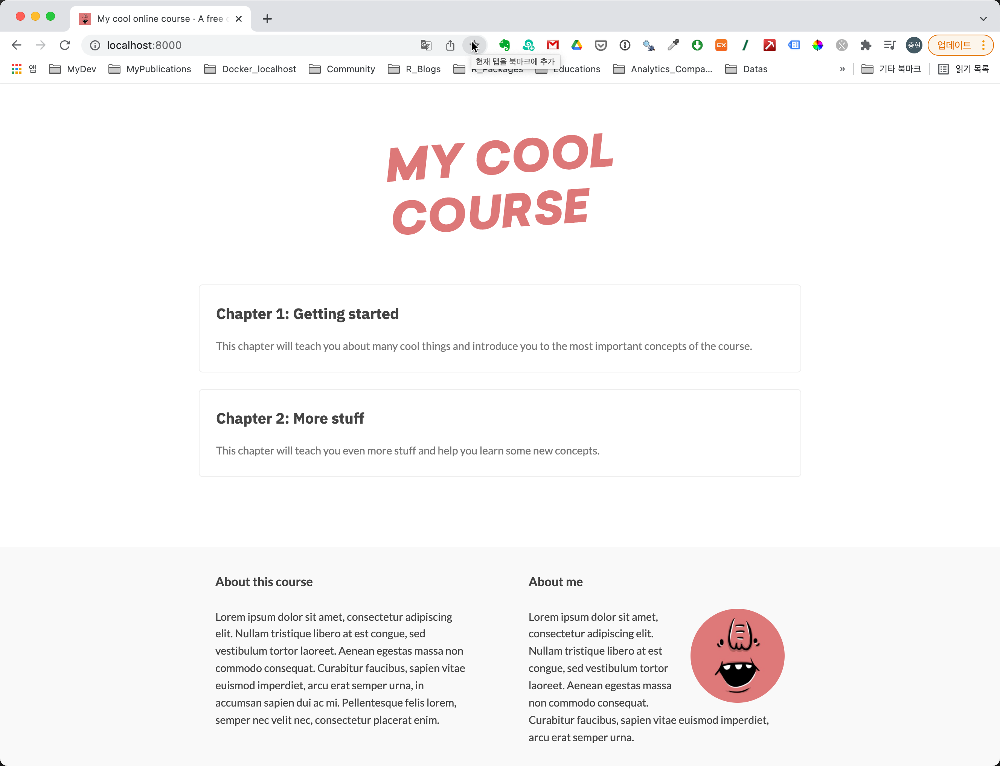

```{r setup, include=FALSE}
knitr::opts_chunk$set(echo = TRUE, 
                      message = FALSE, 
                      warning = FALSE, 
                      collapse = FALSE,
                      fig.align = "center")
knitr::opts_chunk$set(fig.width = 12, fig.height = 9)

library(shiny)
library(htmltools)

xaringanExtra :: use_panelset()
```

```{r tidyverse, echo=FALSE, out.width = "25%", eval=TRUE}

```

```{r, preface, echo=FALSE}
div(class = "preface", 
    h4("들어가기"),
    "온라인 코스 실행해볼까요?!", br(),
    "코스 플랫폼 템플리트는 템플리트일 뿐, 하나씩 만들어 넣어 내 코스를 생성해야죠.", br(),
    "만들고 실행해서 동작해보고, 또 다시 만들고 실행하고...", br(),
    "이를 위해서 RStudio에서 생성한 코스를 실행하는 방법을 먼저 배워봅니다.")
```

## 코스 템플리트 둘러보기
코스 플랫폼을 개발하기 위해서는 콘솔 CLI(Command-line interface)에서의 작업이 필요합니다. 그러나 여기서는 별도의 터미널이 아닌 RStudio 안에서 모두 작업해보겠습니다.

### 코스 플랫폼 프로젝트 구동

이네스는 코스 플랫폼 템플리트로 RStudio 프로젝트를 만들었습니다. 해당 프로젝트를 구동하면, 다음과 같은 화면을 볼 수 있습니다.

에디터 창에 **package.json** 파일을 띄워 놓은 화면입니다. 

```{r intro-rstudio, echo=FALSE, out.width = "100%"}

```

<br>

### 코스 플랫폼의 파일 구조
RStudio의 **Terminal** 탭은 운영체제의 터미널 콘솔을 띄워줍니다. 여기서 CLI를 통해서 터미널 명령어를 수행할 수 있습니다. 현재 이 문서는 MacOS에서 작업하고 있기 때문에 zsh 터미널이 구동됩니다. 왜냐하면 2019년도 macOS Catalina나 버전부터 zsh이 기본 쉘이 되었기 때문입니다.

템플리트의 첫번째 디렉토리를 포함한 파일을 살펴봅니다.

```{r tree-l1, echo=TRUE, eval=FALSE}
tree -L 1
```

템플리트의 첫번째 디렉토리를 포함한 파일 구조는 다음과 같습니다. 

```{r tree-l1-img, echo=FALSE, out.width = "90%"}

```

<br>

주요 디렉토리와 파일을 요약하면 다음과 같습니다. (d)는 디렉토리를 의미합니다.

* binder (d)
    - Binder에 설치할 R 이미지와 패키지 설치 관련 정보 파일
* chapters (d)
    - 코스의 챕터별 컨텐츠를 정의하는 마크다운 문서 위치
* exercises (d)
    - 코스의 연습문제를 정의하는 R 스크립트 파일 위치 
* gatsby-browser.js
    - Gatsby 앱 브라우징 설정 파일
* gatsby-config.js
    - Gatsby 앱 설정 파일
* gatsby-node.js
    - Gatsby의 Node.js 설정 파일
* meta.json
    - 이네스 코스를 정의하는 메타정보 설정 파일
* package-lock.json
    - 이네스 코스 플랫랫폼에서 사용하는 Node.js 패키지의 의존성 정보 파일
* package.json
    - 이네스 코스 플랫랫폼에서 사용하는 Node.js 패키지 목록 파일
* slides (d)
    - 코스의 슬라이드 컨텐츠를 정의하는 마크다운 문서 위치
* src (d)
    - 이네스 코스 플랫랫폼 구성 Gatsby 소스 코드
* static (d)
    - 이네스 코스 플랫폼에서 사용하는 정적 이미지 파일 위치
* theme.sass
    - 이네스 코스 플랫폼의 테마 설정 파일

템플리트의 둘째 디렉토리를 포함한 파일을 살펴봅니다.

```{r tree-l2, echo=TRUE, eval=FALSE}
tree -L 2
```

템플리트의 둘째 디렉토리를 포함한 파일 구조는 다음과 같습니다. 이 글이 이네스 플랫폼에 대한 이해 수준의 범위라, 이런 파일들이 있구나 정도로 이해하시기 바랍니다. 

```{r tree-l2-img, echo=FALSE, out.width = "90%"}

```

## RStudio 프로젝트 환경 설정하기

### Node.js 패키지 설치하기
이네스가 배포한 템플리트로 만든 RStudio 프로젝트를 처음 구동한 후 Node.js 패키지를 설치합니다.

운영체제 터미널 CLI 환경에서 설치해야 하지만, RStudio가 터미널을 지원하기 때문에 **"Console"** 패널의 **"Terminal"** 탭을 눌러 터미널을 엽니다. 그리고 다음의 명령을 입력합니다. 이미 앞에서 Node.js 패키지 설치 관리자인 npm을 설치했기 때문에 npm 명령어를 입력할 수 있습니다.

```{r npm-install, echo=TRUE, eval=FALSE}
npm install
```

`npm install` 명령어는 **package-lock.json** 파일에 기술된 Node.js 패키지를 설치합니다. 다음 그림처럼 코스 플랫폼 구축에 필요한 Node.js 패키지들을 설치하기 시작합니다. 

```{r npm-install-img, echo=FALSE, out.width = "100%"}

```

그런데 필자의 환경에서는 Node.js 패키지 설치 시 에러가 발생했습니다. 발생한 에러의 다음 부분(버전 정보)을 주의 깊게 볼 필요가 있습니다. 필자의 Node.js 환경입니다. 

```{r, echo=TRUE, eval=FALSE}
npm ERR! gyp ERR! node -v v17.2.0
npm ERR! gyp ERR! node-gyp -v v3.8.0
```

2021-12-11 기준으로 이네스가 배포한 템플리트는 3년이 경과하였습니다. 그래서 현재 필자의 Node.js 환경과 과거의 패키지가 충돌한 것입니다. 왜냐하면 **package-lock.json**에는 3년 전에 설치했던 버전의 Node.js 패키지들이 기술되어 있기 때문입니다.

다음에 **package.json** 파일과 **package-lock.json** 파일의 일부분을 비교합니다.

<br>

::: {.panelset}

::: {.panel}
#### package.json

```{r, echo=TRUE, eval=FALSE}
{
    "name": "course-starter-r",
    "private": true,
    "description": "Starter package to build interactive R courses",
    "version": "0.0.1",
    "author": "Ines Montani <ines@explosion.ai>",
    "dependencies": {
        "@illinois/react-use-local-storage": "^1.1.0",
        "@jupyterlab/outputarea": "^0.19.1",
        "@jupyterlab/rendermime": "^0.19.1",
        "@phosphor/widgets": "^1.6.0",
        "autoprefixer": "^9.4.7",
        "classnames": "^2.2.6",
        "codemirror": "^5.43.0",
        "gatsby": "^2.1.4",
        "gatsby-image": "^2.0.29",
        "gatsby-plugin-manifest": "^2.0.17",
        "gatsby-plugin-offline": "^2.0.23",
        "gatsby-plugin-react-helmet": "^3.0.6",
        "gatsby-plugin-react-svg": "^2.1.1",
        "gatsby-plugin-sass": "^2.0.10",
```
:::

::: {.panel}
#### package-lock.json

```{r, echo=TRUE, eval=FALSE}
{
    "name": "course-starter-r",
    "version": "0.0.1",
    "lockfileVersion": 1,
    "requires": true,
    "dependencies": {
        "@babel/code-frame": {
            "version": "7.0.0",
            "resolved": "https://registry.npmjs.org/@babel/code-frame/-/code-frame-7.0.0.tgz",
            "integrity": "sha512-OfC2uemaknXr87bdLUkWog7nYuliM9Ij5HUcajsVcMCpQrcLmtxRbVFTIqmcSkSeYRBFBRxs2FiUqFJDLdiebA==",
            "requires": {
                "@babel/highlight": "^7.0.0"
            }
        },
        "@babel/core": {
            "version": "7.4.3",
            "resolved": "https://registry.npmjs.org/@babel/core/-/core-7.4.3.tgz",
            "integrity": "sha512-oDpASqKFlbspQfzAE7yaeTmdljSH2ADIvBlb0RwbStltTuWa0+7CCI1fYVINNv9saHPa1W7oaKeuNuKj+RQCvA==",
            "requires": {
                "@babel/code-frame": "^7.0.0",
                "@babel/generator": "^7.4.0",
```

:::

:::

<br>

Gatsby에서 필요한 패키지를 `package.json` 파일에 기술합니다. 패키지 이름과 **version range**를 기술합니다. 패키지 의존성을 위한 선언인 `version range`는 버전의 범위를 의미합니다. 특정 버전을 의미하는 것은 아닙니다. 

`package.json` 파일의 일부분인 다음의 ^2.0.17이 `version range`입니다. '^'로 시작하는 버전 번호 이후의 버전을 설치하라는 의미입니다. 2.0.17 버전을 설치하라는 의미는 아닙니다. 만약 패키지 배포 리파지토리의 'gatsby-plugin-manifest' 버전이 2.0.17라면 2.0.17 버전을 설치하지만, 새로운 버전이 패치되어 올라온 시점에서는 2.0.18 혹은 2.1.4와 같은 버전을 설치할 수도 있습니다.[^1] 

[^1]: https://hyunjun19.github.io/2018/03/23/package-lock-why-need/ 페이지 참고

```{r, echo=TRUE, eval=FALSE}
"gatsby-plugin-manifest": "^2.0.17",
```

그런데 실제로 **package-lock.json** 파일에 담긴 'gatsby-plugin-manifest' 버전은 다음처럼 2.0.29였습니다.

```{r, echo=TRUE, eval=FALSE}
        "gatsby-plugin-manifest": {
            "version": "2.0.29",
            "resolved": "https://registry.npmjs.org/gatsby-plugin-manifest/-/gatsby-plugin-manifest-2.0.29.tgz",
            "integrity": "sha512-zxUuoKxjjdEyj8Xh/svTIOhaIjONB2txel441yJXoYfHmNndysEn+DcYUMkN4xQwZLIaVKoQZ/fCNcVhUOUGIg==",
            "requires": {
                "@babel/runtime": "^7.0.0",
                "sharp": "^0.21.3"
            }
        },
```

**`npm install` 명령으로 패키지를 설치하면, 설치한 시점에 패키지 배포 리파지토리의 물리적인 패키지를 포함한 의존성 트리 정보를 담아서 package-lock.json 파일을 만듭니다. 그리고 이후에 `npm install` 명령으로 패키지를 설치하면, package-lock.json 파일에 기술된 패키지 파일을 설치하게 됩니다.**

그러므로 package-lock.json 파일에는 3년 전에 이네스가 코스 플랫폼 개발 시점 패키지의 의존성 트리 정보를 담고 있고, 그 정보대로 패키지를 설치하면서 오류가 발생한 것입니다. 

**사실 package-lock.json는 유용한 정보입니다. 개발 환경이 서로 다른 여러 사람들에세 의존성 트리는 개발자가 개발환 환경과 동일하게 패키지를 설치해 주기 때문에 배포한 프로그램이 정상적으로 동작하게 됩니다.** 그러나 사례처럼 3년 이 지난 시점에는 이러한 유용한 기능이 오히려 문제가 된 것입니다. 오픈소스 진영에서 3년이라는 세월은 일반 생활에서 10년보다 더 긴 세월이기 때문입니다. 강산이 몇 번 변했을 시간이 흐른 것입니다.

결단을 내려야 합니다. **package-lock.json** 파일을 삭제합니다. 그러면 Node.js 패키지 설치 관리자인 npm은 **package.json** 파일의 `version range`을 참고하여 패키지를 설치하게 됩니다.

package-lock.json 파일을 삭제 후 다음 명령을 재실행 합니다.

```{r npm-install2, echo=TRUE, eval=FALSE}
npm install
```

다음처럼 설치가 완료됩니다.

```{r done-install, echo=FALSE, out.width = "100%"}

```

무려 2,790개의 패키지가 설치되었습니다. Node.js 패키지는 프로젝트 리렉토리 내의 **node_modules** 디렉토리에 생성됩니다.

그런데 security audit에 몇개의 항목이 검출되었습니다.

보안성 검사에서 도출된 문제의 항목들은,

```{r npm-audit, echo=TRUE, eval=FALSE}
npm audit fix
```

혹은

```{r npm-audit2, echo=TRUE, eval=FALSE}
npm audit fix --force
```

명령어로 복구할 수 있다고 하였지만, 해당 명령어를 수행해 본 결과 모든 문제를 해결하지 못했고 반복적으로 몇번 수행하면 한두개씩 줄다가 더이상 줄지 않았습니다. 문제는 코스 플랫폼이 구동 시 에러가 발생하여 어플리케이션이 구동되지 않았습니다.

일단은, security audit  결과는 무시합니다.

## 어플리케이션 실행

이제 코스 플랫폼의 코스 컨텐츠를 개발할 수 있는 환경이 구성되었습니다.

### 개발 서버의 구동

콘솔에서 다음 명령을 수행하면, 코스 템플리트 앱이 구동됩니다.

```{r run-dev, echo=TRUE, eval=FALSE}
npm run dev  
```

실행되는 과정에서 다음처럼 에러 메시지 같은 것이 출력됩니다.

```{r run-start, echo=FALSE, out.width = "100%"}

```

그러나 다음처럼 개발 앱의 build는 성공합니다.

```{r run-end, echo=FALSE, out.width = "100%"}

```

5개의 경고가 발생하였고 2개의 경고는 수정할 수 있다는 메시지가 있습니다만, 무시합니다.

숙제가 남은 실행입니다. 경고 메시지를 수정하고 싶은 욕구는 충만하나 Gatsby 개발자가 아니라, 일단은 무시하고 진행합니다. 

### 코스 템플리트 앱의 실행
로컬 환경에 개발 서버가 구동되면 8000번 포트로 앱을 실행할 수 있습니다. 웹 브라우저에 다음 URL을 입력하여 템플리트 코스를 실행합니다.

````
localhost:8000 
````

그러면 다음과 같은 템플리트 코스를 만날 수 있습니다.

```{r intro-app, echo=FALSE, out.width = "100%"}

```


## 요약 

### 작업 요약

* 이네스의 코스 템플리트를 실행할 수 있도록 Node.js 패키지를 설치했습니다.
* 개발 서버를 구동해서 코스 템플리트를 실행했습니다.

### I can do it

* Gatsby 어플리케이션을 실행할 수 있습니다.
* 이네스 템플리트로 사용자 개발 환경을 만들 수 있습니다.

