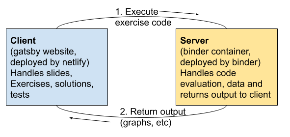
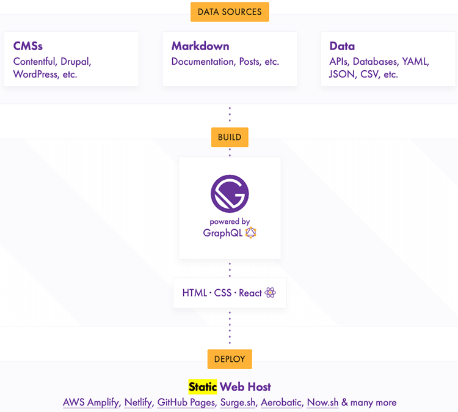
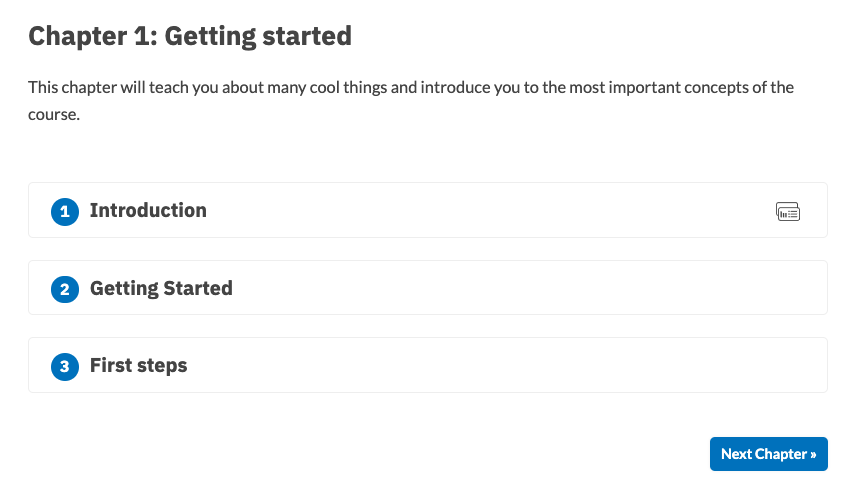
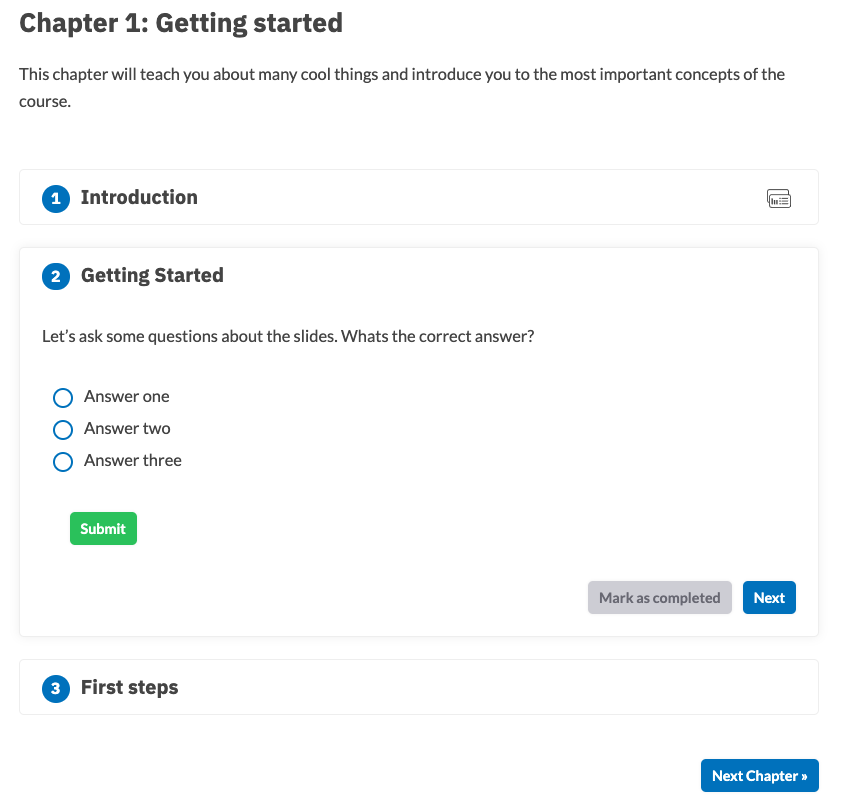
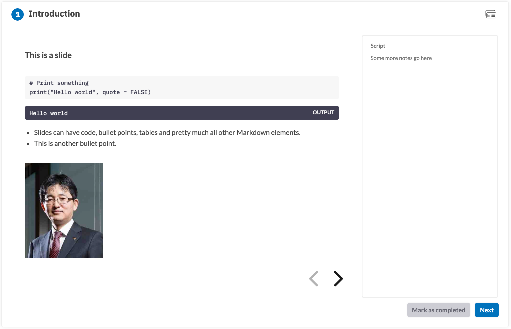
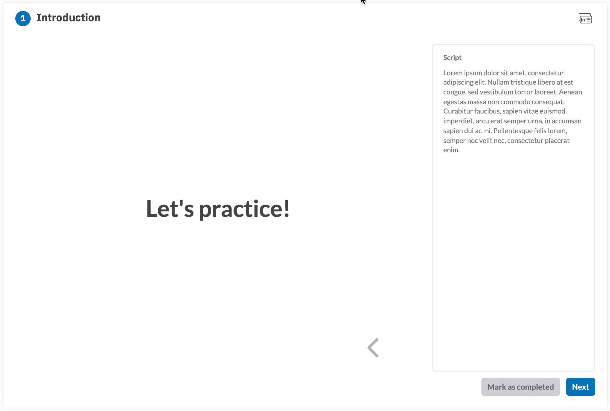
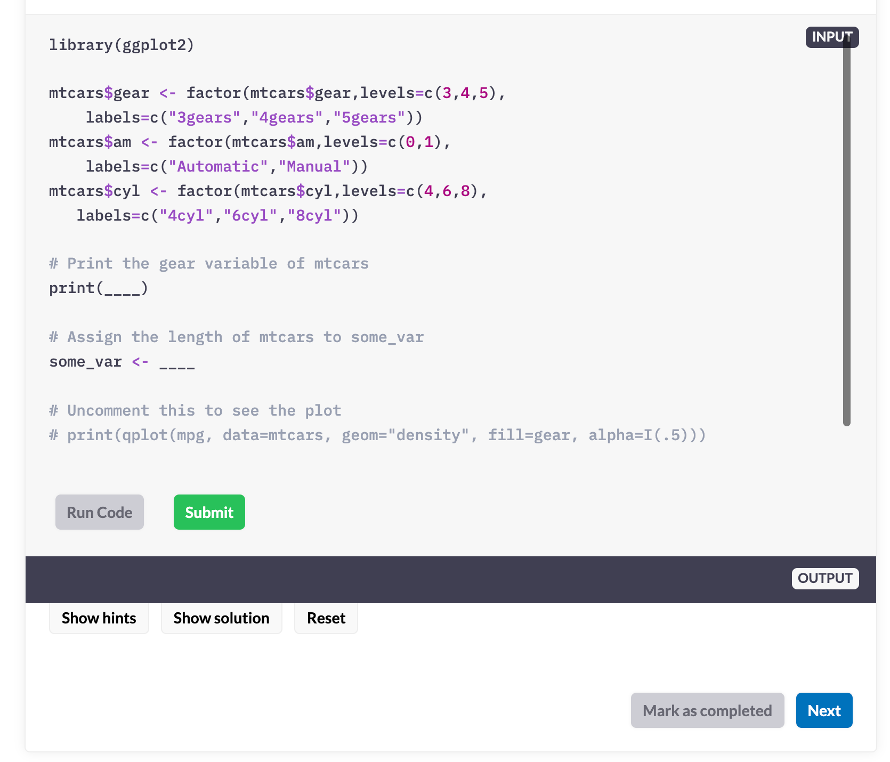
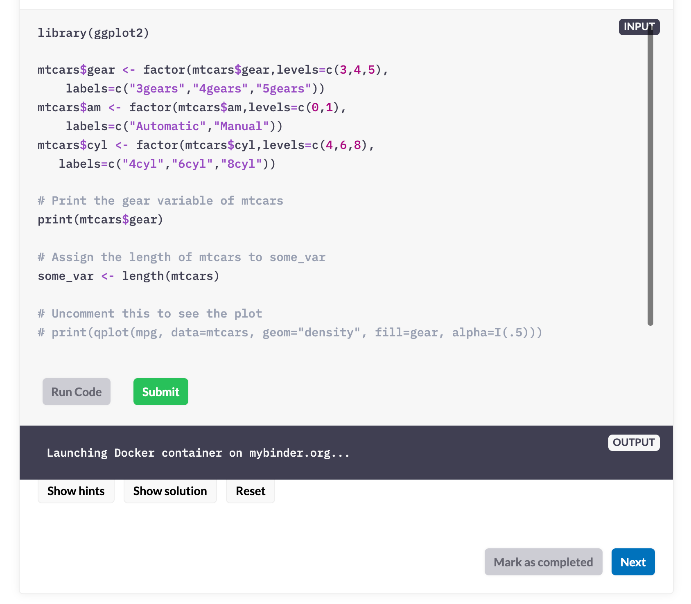
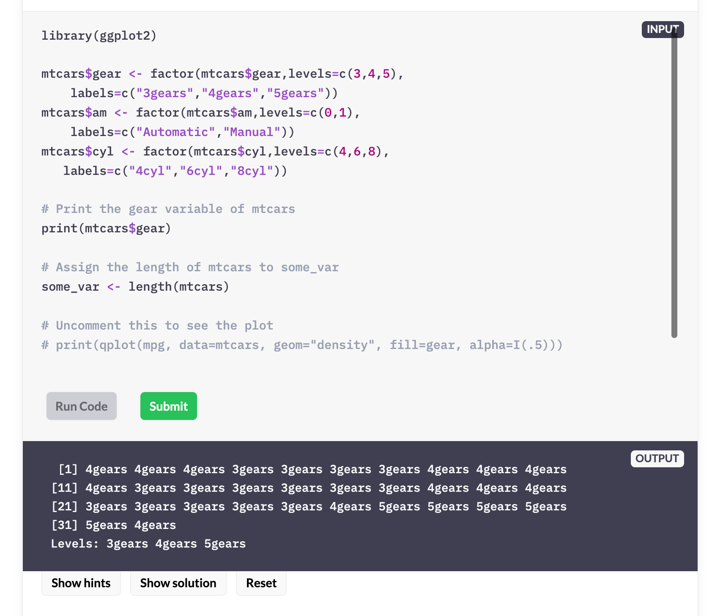

```{r setup, include=FALSE}
knitr::opts_chunk$set(echo = TRUE, 
                      message = FALSE, 
                      warning = FALSE, 
                      collapse = FALSE,
                      fig.align = "center")
knitr::opts_chunk$set(fig.width = 12, fig.height = 9)

library(shiny)
library(htmltools)

xaringanExtra :: use_panelset()
```

```{r ines, echo=FALSE, out.width = "25%", eval=TRUE}

```

```{r, preface, echo=FALSE}
div(class = "preface", 
    h4("들어가기"),
    "오픈소스 생태계는 살아 있습니다. 어쩌면 나눔 시장과 같습니다.", br(),
    "필요한 것은 어느 곳에 있기 마련입니다. 때로는 그것을 찾기 어려울 수 있지만요.", br(),
    "이네스가 만든 코스 플랫폼도 그 중 하나가 아닐까요? 어쩌면 그렇게 DataCamp와 유사하게 구현해 놓았을까요.", br(),
    "여러분은 이네스가 펼쳐 놓은 자리에서 코스 플랫폼을 무료로 득템할 수 있는 기회를 얻으셨습니다.")
```

## 이네스 코스 플랫폼 이해

### 이네스 코스 플랫폼의 명명

[이네스 몬타니](https://ines.io/){target="_blank"}는 인공지능과 자연어 처리 기술을 연구하는 소프트웨어 개발자이자 [Explosion](https://explosion.ai/){target="_blank"}의 공동 설립자이자 CEO입니다.

이네스 코스 플랫폼은 데이터캠프와 결별한 코스 컨텐츠 프로바이더들 중의 이네스 몬타니(Ines Montani)가 개발한 코스 플랫폼입니다. 플랫폼의 고유 명칭이 없기 때문에 편의상 **이네스 코스 플랫폼**이라 부르겠습니다.

### 이네스 코스 플랫폼 UI/UX

이네스 코스 플랫폼의 UI/UX는 DataCamp와 유사합니다. DataCamp에서 구동되는 코스 플랫폼을 포팅한 것이기 때문에 마치 DataCamp 클론처럼 유사한 기능으로 구성되어 있습니다.

개인적으로는 learnr의 UI/UX보다 좀더 친숙해서, 상대적으로 끌리는 플랫폼입니다.

### 이네스 코스 플랫폼 적용 코스

* R Bootcamp
  - [https://r-bootcamp.netlify.app/](https://r-bootcamp.netlify.app/){target="_blank"}
  - Ted Laderas and Jessica Minnier
* Supervised Machine Learning: Case Studies in R
  - [https://supervised-ml-course.netlify.app/](https://supervised-ml-course.netlify.app/){target="_blank"}
  - Julia Silge

## 이네스 코스 플랫폼 구조

### 이네스 코스 플랫폼의 구조

다음 삽화는 이네스가 제시한 플랫폼의 구조[^1]입니다.

[^1]: https://user-images.githubusercontent.com/3315629/60834090-b49d5980-a174-11e9-9d69-966084ba97b9.png

{width=100% height=100%}

### 서버와 클라이언트의 상호 작용

웹 어플리케이션에서의 UI/UX를 담당하는 **프론트 엔드 부분의 클라이언트**는 **Gastby** JavaScript를 사용합니다. 코스를 위한 강의 슬라이드와 연습문제, 퀴즈 등의 처리는 Gastby가 담당합니다. 엄밀히 말하면 슬라이드는 **reveal.js**가 담당합니다.

**백 엔드의 서버 영역**은 **Binder**를 사용합니다. Binder는 연습문제인 R 스크립트를 실행한 후 결과를 프론트 엔드인 Gastby에 전달해 줍니다.

### Juniper

이네스는 Jupyter 커널을 사용하여 Binder 컨테이너와의 통신을 처리하기 위해 **Juniper**라고 하는 Gatsby용 JavaScript 플러그인을 개발했습니다. 

Juniper는 **R 스크립트를 Binder의 도커 컨테이너에 보내 스크립트를 실행**하고, **실행 결과의 출력과 시각화 이미지를 수신**하는 작업을 수행합니다.


## Gatsby

**정적 사이트(static site)**는 HTML, CSS, JavaScript로만 만들어진 사이트를 의미합니다. R/데이터 분석 등과 같은 기술 문서 기반의 블로그들이 정적 사이트 생성기를 통해서 만들어 지고 있습니다. 대표적인 것이 **[Jekyll(지킬)](https://jekyllrb.com/){target="_blank"}**과 blogdown 패키지가 채용하고 있는 **[HUGO(휴고)](https://gohugo.io/){target="_blank"}**가 대표적입니다. 그리고 근래에는 **[Gatsby(개츠비)](https://www.gatsbyjs.com/){target="_blank"}**가 인기를 끌고 있습니다.

대중성은 Jekyll -> HUGO -> Gatsby의 순서로 무게추가 이동하고 있습니다. 이들 정적 사이트 개발기는 Markdown 파일을 웹 페이지로 변환하여 웹 사이트를 개발합니다. R의 **blogdown 패키지**는 R Markdown 문서를 정적 웹 페이지로 만들어 주기 때문에 R 사용자가 쉽게 블로그와 같은 웹 사이트를 개발할 수 있습니다. **distill 패키지**도 마찬가지입니다.

<br>

:::: {style="display:grid; grid-template-columns: 20% 5% 75%; grid-row-gap: 80px; align-self:start"}

::: {style="margin-top: 5px"}

```{r gatsby-logo, echo=FALSE, out.width = "100%"}
knitr::include_graphics("img/gatsby.png")
```

:::

::: {style="margin-top: 15px"}
:::

::: {style="color:grey"}

"Gatsby는 최근 대세로 자리잡은 **React(리액트) 기반**으로 웹 사이트를 만드는 프레임워크입니다. 정적 웹 사이트나 블로그를 아주 쉽고 빠르게 개발할 수 있어 때문에 블로그 개발에 자주 활용됩니다. Gatsby는 **Markdown 문서를 정적 웹 페이지를 만들어**주고, 배포할 때 웹 페이지로 빌드되기 때문에 별도의 웹 어플리케이션 서버(WAS)가 없이도 운영이 가능합니다." 

:::

::::

<br>

Gatsby의 스키마는 다음과 같습니다. Gatsby는 [GraphQL](https://graphql.org/){target="_blank"} 이라는 기술을 이용헤서 데이터 소스에서 데이터를 가져다가 정적 사이트를 만들어 줍니다. 마크다운 문서도 데이터 소스 중의 하나입니다.

<br>

```{r gatsby-arch, echo=FALSE, out.width = "85%"}

```

<br>

코스 수강자에게 보여지는 코스 컨텐츠와 UI/UX는 Gatsby로 만들어 진 것입니다.


## mybinder.org

**[Binder(mybinder.org)](https://mybinder.org/){target="_blank"}**는 **[Github](https://github.com/){target="_blank"}** 저장소(Repository) URL만 입력하면 저장되어 있는 소스 코드와 프로젝트 설정으로 **[Jupyter Notebook](https://jupyter.org/){target="_blank"}**을 실행시켜 주는 서비스를 제공합니다. 그러므로 프로젝트의 **재현성(Reproducible)을 위한 유용한 도구**이자, 무료 도구입니다.


<br>

:::: {style="display:grid; grid-template-columns: 20% 5% 75%; grid-row-gap: 80px; align-self:start"}

::: {style="margin-top: 0px"}

```{r jupyter, echo=FALSE, out.width = "100%"}
knitr::include_graphics("img/jupyter.png")
```

:::

::: {style="margin-top: 15px"}
:::

::: {style="color:grey; margin-top: 15px;"}

"**Jupyter Notebook**은 코드, 시각화 및 텍스트가 포함된 문서를 만들고 공유하기 위한 웹 애플리케이션입니다. 주로 데이터 과학, 통계 모델링, 기계 학습 등에서 사용되고 있습니다. **Interactive한 웹 기반의 IDE**로, Python 코드를 넣으면 원격 서버에서 명령이 실행되어 결과가 보여집니다. 주요한 것은 Python 뿐만 아니라, **R 등 다수의 오픈소스 컴퓨터 언어를 지원**한다는 점입니다."

:::

::::

<br>

Github도 Github Pages 기능이 있어, *.github.io와 같은 URL로 정적 웹 페이지를 공유할 수 있어 유용하게 사용하고 있습니다. 

Binder에서 Github 리파지토리를 읽어서 R 실행이 가능한 도커 컨테이너를 만들어 제공하는 것은, 여러 사람들이 동일한 환경에서 Github 리파지토리의 R 프로그램을 재현할 수 있어, 이 기능 역시 매력적입니다. 여러 수강생을 위한 코스 실행 환경에 적합합니다.

<br>

:::: {style="display:grid; grid-template-columns: 20% 5% 75%; grid-row-gap: 80px; align-self:start"}

::: {style="margin-top: 10px"}

```{r binder-ci, echo=FALSE, out.width = "100%"}

```

:::

::: {style="margin-top: 0px"}
:::

::: {style="color:grey"}

"**mybinder.org**가 제공하는 컨테이너는 R을 실행할 수 있는 환경은 물론, **RStudio와 Shiny도 지원**합니다. 이것은 RStudio Server처럼 웹 환경에서 RStudio를 실행할 수 있고, Shiny 앱도 띄워준다는 것을 의미합니다. 그러므로 [shinyapps.io](https://www.shinyapps.io/){target="_blank"}를 대체할 수도 있습니다. 이것은 **learnr 패키지로 만든 코스**를 shinyapps.io가 아닌 **mybinder.org에도 배포가 가능**하다는 것을 의미합니다." 

:::

::::

<br>

코스 수강자가 Gatsby로 구현한 정적 웹 페이지에서 작성한 R Script는 Binder의 도커 컨테이너에서 실행됩니다. 이네스가 개발한 Juniper Javascript가 이 두 시스템을 연결시켜주는 기능을 수행합니다.


## 코스 컨텐츠 작성

앞서 Gatsby는 GraphQL를 이용해서 데이터 소스인 Markdown 파일을 가져다 정적 페이지를 작성한다고 언급했습니다. 그러면 이네스 플랫폼에서는 어떻게 하습 컨텐츠로 만들어지는지 살펴봅니다.

### chapter 
chapter 디렉토리의 Markdown 파일은 강의 챕터(chapter)를 만들어 줍니다.

<br>

::: {.panelset}

::: {.panel}
#### 챕터 Markdown 소스

```{r, echo=TRUE, eval=FALSE}
---
title: 'Chapter 1: Getting started'
description:
  'This chapter will teach you about many cool things and introduce you to the
  most important concepts of the course.'
prev: null
next: /chapter2
type: chapter
id: 1
---

<exercise id="1" title="Introduction" type="slides">

<slides source="chapter1_01_introduction">
</slides>

</exercise>

<exercise id="2" title="Getting Started">

Let's ask some questions about the slides. Whats the correct answer?

<choice>
<opt text="Answer one">

This is not the correct answer.

</opt>

<opt text="Answer two" correct="true">

Good job!

</opt>

<opt text="Answer three">

This is not correct either.

</opt>
</choice>

</exercise>

<exercise id="3" title="First steps">

This is a code exercise. The content can be formatted in simple Markdown – so
you can have **bold text**, `code` or [links](https://spacy.io) or lists, like
the one for the instructions below.

- These are instructions and they can have bullet points.
- The code block below will look for the files `exc_01_03`, `solution_01_03` and
  `test_01_03` in `/exercises`.

<codeblock id="01_03">

This is a hint.

</codeblock>

</exercise>

```

:::

::: {.panel}
#### 랜더링된 챕터 컨텐츠

랜더링된 화면의 일부입니다. Gatsby는 Netlify(넷리파이)와 같은 정적 웹 서비스 호스팅 서버로 배포(Deploy)될 때, 다음과 같은 웹 페이지를 생성합니다. 



마크다운 파일에 기술한 퀴즈도 생성해줍니다.




:::

:::

#### YAML 헤더
Markdown의 YAML 헤더는 다음과 같습니다.

* title: 챕터 타이틀
* description: 챕터 개요
* prev: 이전 챕터
* next: 이후 챕터 
* type: 컨텐츠 타입
  - 챕터일 경우에는 chapter
* id: 컨텐츠 아이디

#### 주요 Tags
 
* <exercise> : 챕터 내 학습 내역 구간 정의
* <slides> : 슬라이트 Lecture 정의
* <choice> : 선택형 퀴즈 정의
* <codeblock> : 핸즈온 연습문제 정의

<br>

### slides

slides 디렉토리의 Markdown 파일은 강의 슬라이드(slides) 노트를 만들어 줍니다.

<br>

::: {.panelset}

::: {.panel}

#### 슬라이드 노트 Markdown 소스

````
---
type: slides
---

# Introduction

Notes: Text at the end of a slide prefixed like this will be displayed as
speaker notes on the side. Slides can be separated with a divider: ---.

---

# This is a slide

```r
# Print something
print("Hello world", quote = FALSE)
```

```out
Hello world
```

- Slides can have code, bullet points, tables and pretty much all other Markdown
  elements.
- This is another bullet point.


Notes: Some more notes go here

---

# Let's practice!

Notes: Lorem ipsum dolor sit amet, consectetur adipiscing elit. Nullam tristique
libero at est congue, sed vestibulum tortor laoreet. Aenean egestas massa non
commodo consequat. Curabitur faucibus, sapien vitae euismod imperdiet, arcu erat
semper urna, in accumsan sapien dui ac mi. Pellentesque felis lorem, semper nec
velit nec, consectetur placerat enim.

````

:::

::: {.panel}
#### 랜더링된 슬라이드 노트 컨텐츠

랜더링된 슬라이드 노트 화면의 일부입니다. 코스를 숙강하는 수강자들이 데이터분석 이론이나 기술을 학습하는 영역입니다. 스크립트는 강사의 좀 더 구체적인 학습 내용의 설명 등을 기술할 수 있습니다.
프리젠테이션 문서의 발표 스크립트 정도로 이해하시면 됩니다.




슬라이드 노트의 마지막 페이지 예제입니다.



:::

:::


#### YAML 헤더
Markdown의 YAML 헤더는 다음과 같습니다.

* type: "slides"로 기술하는 컨텐츠 타입

#### 주요 Tags
Markdown 태그를 지원하며, 다음의 추가 태그를 제공합니다.

* \-\-\- : 슬라이드 노트 페이지 구분자
* Notes: : 학습 내용을 설명하는 스크립트 정의
* ```out : 출력을 정의하는 코드 청크

<br>

### exercises
exercises 디렉토리의 R 파일은 강의 연습문제(exercises)를 만들어 줍니다.

연습문제인 exercises 디렉토리에는 하나의 연습문제를 위한 3개의 파일로 구성된 R 스크립트 파일이 위치합니다.

챕터(chapter)의 Markdown 문서 중에서 **codeblock** 태그에 대응하는 파일은 파일 이름의 접두어로 그 기능이 구별됩니다. codeblock 태그의 **id** 속성이 포함된  R 스크립트 파일은 만들어야 됩니다.

연습문제 아이디가 'first_exec'라 가정하면 codeblock 태그는 다음과 같이 정의합니다.

````
<codeblock id="first_exec">
</codeblock>
````

* 연습문제 파일
    - 확장자가 'exc_'인 파일
    - exc_first_exec.R
* 연습문제 해답 파일
    - 확장자가 'solution_'인 파일
    - solution_first_exec.R    
* 연습문제 정답 검증 파일
    - 확장자가 'test_'인 파일
    - test_first_exec.R    


이네스 플랫폼 텔플리트의 챕터 파일 포함된 연습문제 예제에는 다음 태그로, 연습문제는 '01_03'라는 아이디의 R 연습문제 파일들을 구동합니다.

````
<codeblock id="01_03">

This is a hint.

</codeblock>
````

<br>

::: {.panelset}

::: {.panel}

#### 연습문제

* exc_01_03.R

```{r, echo=TRUE, eval=FALSE}
library(ggplot2)

mtcars$gear <- factor(mtcars$gear,levels=c(3,4,5),
  	labels=c("3gears","4gears","5gears"))
mtcars$am <- factor(mtcars$am,levels=c(0,1),
  	labels=c("Automatic","Manual"))
mtcars$cyl <- factor(mtcars$cyl,levels=c(4,6,8),
   labels=c("4cyl","6cyl","8cyl"))

# Print the gear variable of mtcars
print(____)

# Assign the length of mtcars to some_var
some_var <- ____

```

:::

::: {.panel}

#### 연습문제 정답

* solution_01_03.R

```{r, echo=TRUE, eval=FALSE}
library(ggplot2)

mtcars$gear <- factor(mtcars$gear,levels=c(3,4,5),
  	labels=c("3gears","4gears","5gears"))
mtcars$am <- factor(mtcars$am,levels=c(0,1),
  	labels=c("Automatic","Manual"))
mtcars$cyl <- factor(mtcars$cyl,levels=c(4,6,8),
   labels=c("4cyl","6cyl","8cyl"))

# Print the gear variable of mtcars
print(mtcars$gear)

# Assign the length of mtcars to some_var
some_var <- length(mtcars)
```

:::

::: {.panel}

#### 연습문제 검증

* test_01_03.R

```{r, echo=TRUE, eval=FALSE}
test <- function() {
    # Here we can either check objects created in the solution code, or the
    # string value of the solution, available as .solution. See the testTemplate
    # in the meta.json for details.
    if (some_var != length(mtcars)) {
        stop("Are you getting the correct length?")
    }
    if (!grepl("print(mtcars$gear)", .solution, fixed = TRUE)) {
        stop("Are you printing the correct variable?")
    }

    # This function is defined in the testTemplate
    success("Well done!")
}
```

:::

::: {.panel}

#### 랜더링된 연습문제

랜더링된 연습문제 화면의 일부입니다. 연습문제는 Binder와 연결되어 실행됩니다.

다음 연습문제 화면은 여러 버튼을 통해서 연습문제의 수행을 진행합니다.




**'Show solution'** 버튼으로 정답을 채운 뒤, **'Run Code'** 버튼으로 연습문제를 실행하면 R 스크립트를 실행합니다. 처음 연습문제를 실행하면 **mybinder.org**의 도커 컨테이너를 연결하는 메시지가 출력되면서 R을 실행할 수 있는 환경을 기다린 후 실행합니다. 제법 시간이 소요됩니다.  



연습문제를 실행한 결과입니다. 여기서 **'Submit'** 버튼을 누르면 **INPUT** 창의 스크립트의 정답 여부를 test_01_03.R 파일의 스크립트가 검증하여, 결과를 출력합니다.



:::

:::

## 결언

이네스 플랫폼에 대해서 개괄적으로 살펴보았습니다. 

데이터 분석을 위한, R을 위한 여러 학습서나 강의 교재, 온라인 문서가 넘칩니다. 그러나 학습의 효과를 고려한다면, 오프라인 강좌를 제외하면 온라인 대화형 학습의 성취도가 높다고 생각합니다.

이네스 플랫폼은 온라인 대화형 학습을 지원하는 플랫폼으로, 공개형 코스 생태계를 만들어 나갈 유용한 자원이라 생각합니다. 이 플랫폼을 이용해서 유용한 온라인 코스 컨텐츠가 많이 만들어지는 것을 소망합니다.

### 이네스 플랫폼 상세 소개
이네스 플랫폼에서 코스 컨텐츠를 만들고, 배포하는 방법의 소개인 **"이네스 코스 개발하기"**를 참고하여, 유용한 온라인 대화형 코스를 만들어 보시기 바랍니다.


