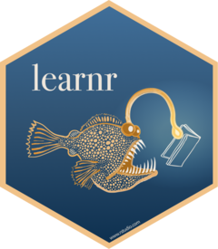

```{r setup, include=FALSE}
knitr::opts_chunk$set(echo = TRUE, 
                      message = FALSE, 
                      warning = FALSE, 
                      collapse = FALSE,
                      fig.align = "center")
library(shiny)
library(htmltools)

xaringanExtra :: use_panelset()
```


```{r learnr-logo, echo=FALSE, out.width = "20%"}

```

```{r, preface, echo=FALSE}
div(class = "preface", 
    h4("들어가기"),
    "또 RStudio라구요?!", br(),
    "RStudio의 데이터 과학자, 소프트웨어 개발자들은 R 생태계를 위한 여러 유용한 패키지를 만들었습니다.", br(),
    "교육에도 관심이 많은 RStudio가 R 온라인 학습을 위한 코스 플랫폼인 leanr 패키지를 만든 것은 우연이 아닙니다.", br(),
    "어떤 방법으로 코스를 진행할 수 있는지, 그들의 코스 솔루션을 살펴보자구요.", br(),
    "엇, 동양의 형설지공과는 차원이 차른 서양의 스케일!!! 반딧불이 아닌, 아구 촉수의 빛으로 책을 읽네요.")
```

## learnr 코스 플랫폼 이해

learnr 코스 플랫폼이라 거창하게 명명했지만, 사실은 learnr 패키지로 만든 대화형 튜토리얼을 만들어서 배포하는 환경을 의미합니다.

### learnr 패키지
learnr는 R Markdown을 사용하여 대화형 튜토리얼(자습서)를 만드는 **R 패키지**입니다. 내러티브, 이미지, 비디오, 퀴즈 및 연습문제를 조합하여 R과 R 패키지 학습을 위한 자기 주도형 튜토리얼을 만들 수 있습니다.

R Markdown을 이용해서 대화형 코스를 만들 수 있다는 것은, 이네스 플랫폼보다 쉽게 온라인 코스를 만들 수 있다는 장점입니다. 이것은 코스를 만드는 과정이 이네스 플랫폼보다는 쉽다는 의미입니다.

### learnr 코스의 특징과 장점

#### R Markdown 기반의 저작

앞서 언급한 것처럼 **R Markdown을 이용**해서 대화형 코스를 만들 수 있다는 것은 장점 중의 하나입니다.

#### shiny 앱

learnr 패키지로 만든 코스(learnr은 대화형 튜토리얼라 칭하지만 편의상 대화형 코스로 이야기하겠습니다.)는 **shiny에서 구동**됩니다. 그러므로 **여러 수강자가 학습하는 환경을 위해서 배포하려면, shiny 서버에 배포**해야 합니다.

일반적으로 shiny 앱은 [shinyapps.io](https://www.shinyapps.io/){target="_blank"}에 배포합니다. 

shinyapps.io 서비스는 다음 가격 정책처럼 5개의 앱 안에서는 무료로 사용할 수 있습니다. 그리고 이 무료 정책은 한달에 25 액티브 시간의 제한이 있습니다. 그러므로 다수의 접속과 학습이 필요한 경우에는 유료 서비스를 사용할 수 있다는 것을 의미합니다.

{width=100% height=100%}

업무상 shiny 앱을 개발한 적이 있어, [https://shiny.rstudio.com/gallery/](https://shiny.rstudio.com/gallery/){target="_blank"}에서 제공하는 Show cases, Demos, Widgets을 참고한 적이 있습니다. 이들 컨텐츠들은 shinyapps.io에서 구동되는데 로딩 시간이 지루하고 일정 시간 후에 세션이 끊기는 문제로, 얻는 정보와 반대급부로 불편한 환경의 경험이 있어서 shinyapps.io가 썩 끌리지는 않습니다.

#### 학습 진도의 기억

learnr 코스의 장점은 수강자가 **학습한 진도를 시스템 내부에서 자동으로 보존**하므로, 나중에 다시 학습을 위해서 코스로 돌아오면 중단한 부분부터 다시 학습할 수 있다는 점입니다. 이네스의 플랫폼에서 제공하지 않는 유용한 기능입니다.


## 코스 컨텐츠 작성

learnr 코스를 만드는 방법을, learnr 패키지가 제공하는 템플리토로 간단하게 소개합니다.

### R Markdown 문서 생성

RStudio에서 File > New File > R Markdown... 메뉴를 선택하면 다음과 같은 다이얼로그 창이 나타납니다. 여기서 "From Template"를 선택 후, Template에서 learnr의 **"Interactive Tutorial"을 선택** 후 문서 이름을 정합니다.  

<br>

```{r dialog-learnr, echo=FALSE, out.width = "70%"}

```

<br>

선택 후 "OK" 버튼을 누르면 다음과 같은 템플리트가 만들어집니다.


### YAML 헤더

learnr 코스의 YAML 헤더는 다음과 같습니다.

```{r, eval=FALSE, echo=TRUE}
---
title: "Tutorial"
output: learnr::tutorial
runtime: shiny_prerendered
---
```

**output**은 **learnr::tutorial**이며, **runtime**은 **shiny_prerendered**을 지정합니다.

### 청크 옵션

learnr 코스는 learnr 패키지를 사용하므로, R Markdown 문서의 도입부에서 learnr 패키지를 불러들여야 합니다.

````
```{r setup, include=FALSE}`r ''`
knitr::opts_chunk$set(echo = FALSE)
```
````

#### exercise 옵션

exercise 옵션은 연습문제를 위한 R Script 작성을 지원합니다. 

<br>

::: {.panelset}

::: {.panel}
#### 옵션 설명 {.panel-name}

exercise 옵션 예시

* exercise = TRUE : exercise를 수행할 수 있는 UI/UX를 만들어 줍니다.
* exercise.lines = 5 : 5줄의 스크립트를 입력할 수 있는 영역을 확보하여 UI를 만듭니다.

:::

::: {.panel}
#### 템플리트에서의 예제  {.panel-name}

````
## Topic 1

### Exercise 

*Here's a simple exercise with an empty code chunk provided for entering the answer.*

Write the R code required to add two plus two:

```{r two-plus-two, exercise=TRUE}`r ''`

```

### Exercise with Code

*Here's an exercise with some prepopulated code as well as `exercise.lines = 5` 
to provide a bit more initial room to work.*

Now write a function that adds any two numbers and then call it:

```{r add-function, exercise=TRUE, exercise.lines = 5}`r ''`
add <- function() {
  
}
```
````
:::

::: {.panel}
#### 실행 결과 {.panel-name}

```{r learnr-exercise, echo=FALSE, out.width = "100%"}

```

:::

:::

<br>

#### hint 옵션

hint 옵션은 exercise 옵션과 함께 사용하여 연습문제에 힌트를 제공합니다. **'Hint'** 버튼을 누르면 힌트 다이얼로그가 출력됩니다.
'Copy to Clipboard' 버튼을 누르면 힌트를 클립보드로 복사하여 사용할 수 있습니다.

<br>

::: {.panelset}

::: {.panel}
#### 옵션 설명 {.panel-name}

exercise 옵션 예시

* exercise.eval = TRUE : 
  - exercise.eval 옵션의 기본값은 FALSE로, TRUE이면 exercise 청크의 R 스크립트를 실행합니다.
  - FALSE이면, 청크의 코드는 실행되지 않고 연습문제 UI에만 출력됩니다. 
* 청크이름-hint : 앞에서 사용한 '청크이름' 뒤에 '-hint'를 붙여 청크를 만드면, 힌트 청크가 됩니다.
  - 청크이름 'print-limit-hint'는 앞에서 정의한 'print-limit' 청크의 힌트 청크를 의미합니다.

:::

::: {.panel}
#### 템플리트에서의 예제  {.panel-name}

````
## Topic 2

### Exercise with Hint

*Here's an exercise where the chunk is pre-evaluated via the `exercise.eval` 
option (so the user can see the default output we'd like them to customize). 
We also add a "hint" to the correct solution via the chunk immediate below 
labeled `print-limit-hint`.*

Modify the following code to limit the number of rows printed to 5:

```{r print-limit, exercise=TRUE, exercise.eval=TRUE}`r ''`
mtcars
```

```{r print-limit-hint}`r ''`
head(mtcars)
```

````
:::

::: {.panel}
#### 실행 결과 {.panel-name}

```{r learnr-hint, echo=FALSE, out.width = "100%"}
knitr::include_graphics("img/learnr-hint.png")
```

:::

:::


#### quiz 함수

quiz는 청크 옵션이 아니라 함수입니다. **quiz()** 함수는 퀴즈를 만들어 줍니다. 그리고, **question()** 함수, **answer()** 함수와 함께 동작합니다.

<br>

::: {.panelset}

::: {.panel}
#### 함수 설명 {.panel-name}

exercise 옵션 예시

* quiz() : 
  - 퀴즈임을 알려 줍니다.
* question() :
  - 퀴즈의 질문을 정의하는 함수입니다.
* answer() :
  - 퀴즈의 답안을 정의하는 함수입다.
  - correct = TRUE를 지정하는 답안이 정답을 의미합니다. 
    - correct = TRUE를 하나의 답안에 지정하면, 레디오 박스로
    - correct = TRUE를 복수로 지정하면, 체크박스로 표현됩니다. (중복 선택)

:::

::: {.panel}
#### 템플리트에서의 예제  {.panel-name}

````
### Quiz

*You can include any number of single or multiple choice questions as a quiz. 
Use the `question` function to define a question and the `quiz` function for 
grouping multiple questions together.*

Some questions to verify that you understand the purposes of various base and 
recommended R packages:

```{r quiz}`r ''`
quiz(
  question("Which package contains functions for installing other R packages?",
    answer("base"),
    answer("tools"),
    answer("utils", correct = TRUE),
    answer("codetools")
  ),
  question("Which of the R packages listed below are used to create plots?",
    answer("lattice", correct = TRUE),
    answer("tools"),
    answer("stats"),
    answer("grid", correct = TRUE)
  )
)
```

````
:::

::: {.panel}
#### 실행 결과 {.panel-name}

```{r learnr-quiz, echo=FALSE, out.width = "100%"}

```

:::

:::


## 결언
learnr 플랫폼에 대해서 개괄적으로 살펴보았습니다.

learnr은 R Markdown으로 간단하게 코스를 생성하기에 좋은 플랫폼입니다. **이네스 코스 플랫폼을 소개하는 이 웹 페이지**에서 **참고로 유사 솔루션인 learnr을 다루었지만**, 이 글을 읽고 **많은 R 사용자가 learnr 코스를 개발하고 공유할 수 있는 기회가 되었으면 합니다.**

### 유용한 learnr 코스 소개

[RStudio Primers(https://rstudio.cloud/learn/primers)](https://rstudio.cloud/learn/primers){target="_blank"}에는 learnr 플랫폼으로 만든 여러 유용한 코스가 많습니다. RStudio Cloud 환경에서 동작하는 코스들입니다. 이 사이트에서 유용한 코스를 학습하시고, learnr 플랫폼의 룩&필과 동작을 이해해 보시기 바랍니다.

### mybinder.org에서의 배포

learnr 코스 shiny 앱을 [shinyapps.io](https://www.shinyapps.io/){target="_blank"}에 배포하지 않고, [https://mybinder.org/](https://mybinder.org/){target="_blank"}에 배포할 수도 있습니다. 일장 일단이 있지만, shinyapps.io의 대체재가 될 수 있으니 참고하시기 바랍니다.


 


